# Chương 1: Giới thiệu về Xây dựng Ứng dụng AI với các Mô hình Nền tảng

Nếu phải dùng một từ duy nhất để mô tả về Trí tuệ Nhân tạo (AI) trong giai đoạn sau năm 2020, thì đó chính là từ "quy mô". Các mô hình AI đứng sau những ứng dụng đình đám như ChatGPT, Gemini của Google, hay Midjourney đã đạt đến một quy mô khổng lồ. Chúng lớn đến mức đang tiêu thụ một phần không hề nhỏ sản lượng điện của toàn thế giới. Hơn nữa, chúng ta còn đang đứng trước nguy cơ cạn kiệt nguồn dữ liệu công khai trên Internet để có thể tiếp tục huấn luyện cho chúng.

Việc các mô hình AI được mở rộng quy mô một cách chóng mặt đã kéo theo hai hệ quả lớn. Thứ nhất, chúng ngày càng trở nên mạnh mẽ và có thể đảm nhiệm nhiều tác vụ phức tạp hơn, từ đó mở đường cho vô số ứng dụng mới ra đời. Ngày càng có nhiều cá nhân và đội nhóm tận dụng sức mạnh của AI để nâng cao năng suất làm việc, tạo ra những giá trị kinh tế mới và cải thiện chất lượng cuộc sống cho con người.

Hệ quả thứ hai là việc huấn luyện các mô hình ngôn ngữ lớn (LLM) đòi hỏi một nguồn lực khổng lồ về dữ liệu, sức mạnh tính toán và cả những tài năng chuyên biệt mà chỉ một vài tổ chức trên thế giới mới có đủ khả năng đáp ứng. Điều này đã thúc đẩy sự ra đời của một xu hướng mới gọi là "mô hình như một dịch vụ" (model as a service). Theo đó, các mô hình do những ông lớn công nghệ phát triển sẽ được cung cấp cho cộng đồng dưới dạng một dịch vụ. Giờ đây, bất kỳ ai có mong muốn xây dựng ứng dụng với AI đều có thể sử dụng các mô hình có sẵn này mà không cần phải tự mình đầu tư chi phí khổng lồ để xây dựng một mô hình từ con số không.

Tóm lại, nhu cầu cho các ứng dụng AI thì ngày càng tăng cao, trong khi rào cản để bắt đầu xây dựng chúng lại ngày càng giảm xuống. Chính điều này đã biến "Kỹ thuật AI" (AI engineering) — một lĩnh vực tập trung vào việc xây dựng các ứng dụng dựa trên những mô hình có sẵn — trở thành một trong những ngành kỹ thuật phát triển nhanh nhất hiện nay.

Thực ra, việc xây dựng ứng dụng dựa trên các mô hình học máy (Machine Learning - ML) không phải là điều gì mới mẻ. Rất lâu trước khi các mô hình ngôn ngữ lớn trở nên phổ biến, AI đã là động lực đằng sau rất nhiều ứng dụng quen thuộc, bao gồm hệ thống gợi ý sản phẩm trên các trang thương mại điện tử, phát hiện gian lận trong giao dịch tài chính, hay dự đoán khách hàng có khả năng rời bỏ dịch vụ. Mặc dù nhiều nguyên tắc để đưa một ứng dụng AI vào vận hành thực tế vẫn không thay đổi, thế hệ các mô hình quy mô lớn và sẵn có ngày nay mang đến những khả năng hoàn toàn mới cùng với những thách thức mới, và đó cũng chính là nội dung trọng tâm của cuốn sách này.

Chương này sẽ bắt đầu bằng việc giới thiệu tổng quan về các "mô hình nền tảng" (foundation models), vốn là chất xúc tác chính đằng sau sự bùng nổ của ngành Kỹ thuật AI. Tiếp theo, tôi sẽ thảo luận về một loạt các trường hợp sử dụng AI đã thành công, qua đó minh họa cho thấy AI hiện đang làm tốt việc gì và chưa làm tốt việc gì. Khi mà khả năng của AI vẫn đang được mở rộng từng ngày, việc dự đoán chính xác tiềm năng của nó trong tương lai ngày càng trở nên khó khăn. Tuy nhiên, bằng cách nhìn vào các mô hình ứng dụng hiện có, chúng ta có thể khám phá ra những cơ hội ngay hôm nay và có được những manh mối về cách AI sẽ tiếp tục được ứng dụng trong tương lai.

Để kết thúc chương, tôi sẽ cung cấp một cái nhìn tổng quan về "hệ thống công nghệ AI" (AI stack) kiểu mới. Hệ thống này bao gồm những gì đã thay đổi kể từ khi có các mô hình nền tảng, những gì vẫn được giữ nguyên, và vai trò của một kỹ sư AI ngày nay khác biệt như thế nào so với một kỹ sư học máy truyền thống.

***

## 1. Sự trỗi dậy của ngành Kỹ thuật AI

Các "mô hình nền tảng" (foundation models) mà chúng ta biết ngày nay thực chất được phát triển từ các "mô hình ngôn ngữ lớn" (large language models). Và các mô hình ngôn ngữ lớn này, đến lượt chúng, lại có nguồn gốc từ những "mô hình ngôn ngữ" (language models) đơn giản hơn rất nhiều.

Mặc dù các ứng dụng như ChatGPT và GitHub Copilot có vẻ như xuất hiện một cách đột ngột và gây chấn động, nhưng thực tế chúng là thành quả được đúc kết từ hàng thập kỷ tiến bộ của công nghệ, với những mô hình ngôn ngữ đầu tiên đã ra đời từ những năm 1950. Trong phần này, chúng ta sẽ cùng nhìn lại những bước đột phá quan trọng đã tạo nên quá trình tiến hóa từ các mô hình ngôn ngữ sơ khai cho đến sự bùng nổ của ngành Kỹ thuật AI ngày nay.

***

### 1.1. Từ Mô hình Ngôn ngữ đến Mô hình Ngôn ngữ Lớn

Mặc dù các mô hình ngôn ngữ đã xuất hiện từ khá lâu, nhưng chúng chỉ có thể phát triển đến quy mô khổng lồ như ngày nay là nhờ vào một phương pháp gọi là "tự giám sát" (self-supervision). Phần này sẽ giải thích sơ lược về mô hình ngôn ngữ và phương pháp tự giám sát là gì. Nếu bạn đã quen thuộc với những khái niệm này, bạn có thể bỏ qua phần này.

#### Mô hình ngôn ngữ

Một mô hình ngôn ngữ thực chất là một hệ thống mã hóa các thông tin mang tính thống kê về một hoặc nhiều ngôn ngữ. Nói một cách dễ hiểu, thông tin này cho chúng ta biết khả năng một từ nào đó sẽ xuất hiện trong một ngữ cảnh nhất định là cao hay thấp. Ví dụ, với ngữ cảnh "Màu yêu thích của tôi là ___", một mô hình ngôn ngữ được huấn luyện với tiếng Anh nên dự đoán từ "xanh dương" (blue) với tần suất cao hơn nhiều so với từ "xe hơi" (car).

Bản chất thống kê của ngôn ngữ thực ra đã được khám phá từ nhiều thế kỷ trước. Trong câu chuyện "Cuộc phiêu lưu của những hình nhân nhảy múa" (The Adventure of the Dancing Men) xuất bản năm 1905, nhân vật Sherlock Holmes đã tận dụng những thông tin thống kê đơn giản của tiếng Anh để giải mã một chuỗi các hình nhân que bí ẩn. Vì chữ cái phổ biến nhất trong tiếng Anh là "E", Holmes đã suy luận rằng hình nhân que xuất hiện nhiều nhất chắc chắn phải đại diện cho chữ "E".

Sau này, Claude Shannon đã sử dụng các phương pháp thống kê phức tạp hơn để giải mã tin nhắn của kẻ thù trong Thế chiến thứ hai. Công trình nghiên cứu của ông về cách mô hình hóa tiếng Anh đã được xuất bản trong bài báo mang tính bước ngoặt vào năm 1951 có tên "Dự đoán và Entropy của Tiếng Anh trong In ấn" (Prediction and Entropy of Printed English). Nhiều khái niệm được giới thiệu trong bài báo này, bao gồm cả "entropy", vẫn còn được sử dụng trong việc lập mô hình ngôn ngữ ngày nay.

Vào những ngày đầu, một mô hình ngôn ngữ thường chỉ xử lý một ngôn ngữ duy nhất. Tuy nhiên, ngày nay, một mô hình ngôn ngữ có thể bao gồm nhiều ngôn ngữ khác nhau.

Đơn vị cơ bản của một mô hình ngôn ngữ được gọi là **"token"**. Một token có thể là một ký tự, một từ, hoặc một phần của từ (ví dụ như hậu tố "-tion" trong tiếng Anh), tùy thuộc vào từng mô hình. Lấy ví dụ, GPT-4, một trong những mô hình đứng sau ChatGPT, sẽ chia cụm từ "I can’t wait to build AI applications" thành chín token, như trong Hình 1-1. Lưu ý rằng trong ví dụ này, từ "can’t" được tách thành hai token là "can" và "’t". Bạn có thể xem cách các mô hình khác nhau của OpenAI phân tách văn bản thành token trên trang web của OpenAI.

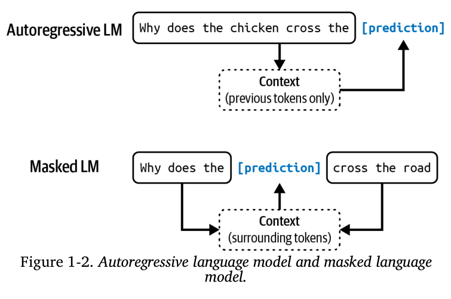

Quá trình chia văn bản gốc thành các token được gọi là **"token hóa" (tokenization)**. Đối với GPT-4, một token trung bình có độ dài xấp xỉ ¾ một từ. Vì vậy, 100 token sẽ tương đương với khoảng 75 từ.

Tập hợp tất cả các token mà một mô hình có thể làm việc được gọi là **"bộ từ vựng" (vocabulary)** của mô hình đó. Bạn có thể sử dụng một số lượng nhỏ các token để tạo ra một số lượng lớn các từ riêng biệt, tương tự như cách bạn dùng một vài chữ cái trong bảng chữ cái để tạo ra vô số từ. Mô hình Mixtral 8x7B có bộ từ vựng với kích thước là 32.000 token. Kích thước bộ từ vựng của GPT-4 là 100.256 token. Phương pháp token hóa và kích thước bộ từ vựng sẽ do các nhà phát triển mô hình quyết định.

***

> **GHI CHÚ**
>
> **Tại sao các mô hình ngôn ngữ lại sử dụng "token" làm đơn vị cơ bản thay vì dùng "từ" (word) hoặc "ký tự" (character)?** Có ba lý do chính:
>
> 1.  So với việc dùng ký tự, token cho phép mô hình chia các từ thành những thành phần nhỏ hơn nhưng vẫn có ý nghĩa. Ví dụ, từ "cooking" (nấu ăn) có thể được chia thành "cook" (nấu) và "ing" (hậu tố chỉ hành động đang diễn ra), cả hai thành phần này đều mang một phần ý nghĩa của từ gốc.
>
> 2.  Bởi vì số lượng token riêng biệt ít hơn số lượng từ riêng biệt, việc này giúp giảm kích thước bộ từ vựng của mô hình. Nhờ đó, mô hình sẽ trở nên hiệu quả hơn về mặt tính toán (điều này sẽ được thảo luận thêm ở Chương 2).
>
> 3.  Token cũng giúp mô hình xử lý được những từ mà nó chưa từng gặp bao giờ. Ví dụ, một từ được tạo ra như "chatgpting" có thể được tách thành "chatgpt" và "ing", giúp mô hình hiểu được cấu trúc và đoán ra ý nghĩa của từ mới này.
>
> Tóm lại, việc sử dụng token là một sự cân bằng hợp lý: nó giúp giảm số lượng đơn vị cần xử lý so với "từ", nhưng vẫn giữ lại được nhiều ý nghĩa hơn so với việc chỉ dùng các "ký tự" riêng lẻ.

***

Hiện tại, có hai loại mô hình ngôn ngữ chính: **mô hình ngôn ngữ che khuất (masked language model)** và **mô hình ngôn ngữ tự hồi quy (autoregressive language model)**. Sự khác biệt cơ bản giữa chúng nằm ở chỗ chúng được phép sử dụng loại thông tin nào để dự đoán một token:

#### Mô hình ngôn ngữ che khuất (Masked language model)

Hãy tưởng tượng bạn đang làm một bài tập điền vào chỗ trống. Đó chính là cách mô hình này hoạt động. Một mô hình ngôn ngữ che khuất được huấn luyện để dự đoán các token bị thiếu ở bất kỳ vị trí nào trong một chuỗi, bằng cách sử dụng ngữ cảnh từ cả **phía trước và phía sau** của chỗ trống đó. Ví dụ, nếu bạn đưa cho nó câu "Màu yêu thích của tôi là ___ màu xanh", mô hình này sẽ dự đoán rằng chỗ trống có khả năng cao nhất là từ "là".

Một ví dụ nổi tiếng của loại mô hình này là BERT (viết tắt của Bidirectional Encoder Representations from Transformers).

Tính đến thời điểm viết cuốn sách này, các mô hình ngôn ngữ che khuất thường được sử dụng cho các tác vụ không yêu cầu tạo ra nội dung mới, chẳng hạn như phân tích cảm xúc (ví dụ: xác định một bình luận là tích cực hay tiêu cực) và phân loại văn bản (ví dụ: phân loại một email là thư rác hay thư quan trọng). Chúng cũng rất hữu ích cho các công việc đòi hỏi sự hiểu biết toàn bộ ngữ cảnh, ví dụ như gỡ lỗi mã lập trình, nơi mô hình cần phải hiểu cả đoạn mã phía trước và phía sau để xác định lỗi.

#### Mô hình ngôn ngữ tự hồi quy (Autoregressive language model)

Ngược lại với mô hình trên, một mô hình ngôn ngữ tự hồi quy được huấn luyện để dự đoán token **tiếp theo** trong một chuỗi, và nó **chỉ** được phép sử dụng các token đã xuất hiện trước đó. Nó giống như việc bạn cố gắng đoán từ tiếp theo trong một câu đang được viết dở. Ví dụ, với câu "Màu yêu thích của tôi là ___", mô hình sẽ dự đoán xem từ tiếp theo nên là gì.

Khả năng đặc biệt của mô hình tự hồi quy là nó có thể liên tục tạo ra hết token này đến token khác, nối tiếp nhau để hình thành một đoạn văn bản hoàn chỉnh. Ngày nay, đây là loại mô hình được lựa chọn hàng đầu cho các tác vụ sinh văn bản (text generation), và vì lý do này, chúng phổ biến hơn nhiều so với các mô hình ngôn ngữ che khuất.

Hình 1-2 dưới đây sẽ minh họa hai loại mô hình ngôn ngữ này.

***

> **GHI CHÚ**
>
> Trong cuốn sách này, trừ khi có ghi chú ngược lại, thuật ngữ "mô hình ngôn ngữ" sẽ được ngầm hiểu là đang đề cập đến "mô hình tự hồi quy".

***

Kết quả đầu ra của các mô hình ngôn ngữ là không hề có giới hạn. Một mô hình ngôn ngữ có thể sử dụng bộ từ vựng cố định và hữu hạn của nó để tạo ra vô số các kết quả khác nhau. Một mô hình có khả năng tạo ra các kết quả không giới hạn như vậy được gọi là mô hình "sinh" (generative), và đó cũng là nguồn gốc của thuật ngữ "AI tạo sinh" (Generative AI).

Bạn có thể hình dung mô hình ngôn ngữ như một **cỗ máy viết tiếp**: khi nhận được một đoạn văn bản (gọi là "prompt" hay câu lệnh đầu vào), nó sẽ cố gắng viết tiếp để hoàn thiện đoạn văn bản đó. Dưới đây là một ví dụ:

**Câu lệnh đầu vào (Prompt) từ người dùng:** “To be or not to be”
**Phần hoàn thiện (Completion) từ mô hình ngôn ngữ:** “, that is the question.”

Điều quan trọng cần lưu ý là những phần viết tiếp này thực chất chỉ là những dự đoán dựa trên xác suất, và **không có gì đảm bảo chúng sẽ luôn chính xác**. Chính bản chất hoạt động dựa trên xác suất này của các mô hình ngôn ngữ đã khiến cho việc sử dụng chúng vừa thú vị nhưng đôi khi cũng rất phiền toái. Chúng ta sẽ tìm hiểu sâu hơn về vấn đề này trong Chương 2.

Nghe thì có vẻ đơn giản, nhưng khả năng viết tiếp này lại cực kỳ mạnh mẽ. Rất nhiều tác vụ, bao gồm dịch thuật, tóm tắt văn bản, viết mã lập trình, và giải toán, đều có thể được diễn đạt lại dưới dạng một tác vụ viết tiếp. Ví dụ, nếu bạn đưa ra câu lệnh: “'How are you' trong tiếng Pháp là…”, một mô hình ngôn ngữ có thể sẽ hoàn thiện nó bằng cụm từ: “Comment ça va”, và thế là nó đã thực hiện xong việc dịch từ ngôn ngữ này sang ngôn ngữ khác.

Thêm một ví dụ khác, với câu lệnh đầu vào như sau:

**Câu hỏi:** Liệu email này có khả năng là thư rác không? Nội dung email như sau:
<*nội dung email*>
**Trả lời:**

Mô hình ngôn ngữ có thể sẽ viết tiếp câu trả lời là: “Có khả năng là thư rác”, và hành động này đã biến mô hình ngôn ngữ thành một bộ lọc thư rác.

Tuy nhiên, dù khả năng viết tiếp rất mạnh mẽ, nó **không giống** với việc tham gia vào một cuộc hội thoại. Ví dụ, nếu bạn hỏi một "cỗ máy viết tiếp" một câu hỏi, thay vì trả lời, nó có thể chỉ đơn giản là viết tiếp câu của bạn bằng cách thêm vào một câu hỏi khác. Phần “Huấn luyện bổ sung” (Post-Training) sẽ thảo luận về cách làm cho mô hình có thể phản hồi một cách phù hợp với yêu cầu của người dùng.

***

### 1.2. Tự giám sát (Self-supervision)

Mô hình ngôn ngữ chỉ là một trong rất nhiều thuật toán của Học máy (Machine Learning). Ngoài ra, còn có các mô hình dùng để nhận dạng vật thể, mô hình hóa chủ đề, xây dựng hệ thống gợi ý, dự báo thời tiết, dự đoán giá cổ phiếu, và nhiều ứng dụng khác. Vậy, các mô hình ngôn ngữ có điều gì đặc biệt mà lại khiến chúng trở thành trung tâm của phương pháp tiếp cận mở rộng quy mô, một phương pháp đã tạo nên "cơn sốt ChatGPT"?

Câu trả lời nằm ở chỗ: các mô hình ngôn ngữ có thể được huấn luyện bằng phương pháp **tự giám sát (self-supervision)**, trong khi nhiều mô hình khác đòi hỏi phải có **sự giám sát (supervision)**. "Giám sát" ở đây nói đến quá trình huấn luyện các thuật toán học máy bằng cách sử dụng "dữ liệu đã được gán nhãn", một loại dữ liệu có thể rất đắt đỏ và tốn thời gian để thu thập. Phương pháp tự giám sát giúp chúng ta vượt qua được rào cản về việc gán nhãn dữ liệu này. Nó cho phép tạo ra những bộ dữ liệu khổng lồ để các mô hình có thể học hỏi, và chính điều này đã mở đường cho việc mở rộng quy mô của chúng. Đây là cách nó hoạt động:

Với phương pháp **giám sát**, bạn phải gán nhãn cho các ví dụ để "chỉ bảo" cho mô hình biết hành vi mà bạn muốn nó học, sau đó huấn luyện mô hình dựa trên những ví dụ này. Khi đã được huấn luyện xong, mô hình có thể được áp dụng cho dữ liệu mới chưa được gán nhãn. Ví dụ, để huấn luyện một mô hình phát hiện gian lận, bạn cần cung cấp cho nó các ví dụ về giao dịch, trong đó mỗi giao dịch đã được gán nhãn là "gian lận" hoặc "không gian lận". Một khi mô hình học được các quy luật từ những ví dụ này, bạn có thể sử dụng nó để dự đoán xem một giao dịch mới có phải là gian lận hay không.

Sự thành công của các mô hình AI trong những năm 2010 phần lớn đến từ phương pháp giám sát. Mô hình đã khởi đầu cho cuộc cách mạng học sâu, AlexNet (công bố năm 2012), chính là một mô hình được giám sát. Nó được huấn luyện để phân loại hơn 1 triệu hình ảnh trong bộ dữ liệu ImageNet vào 1.000 danh mục khác nhau như "xe hơi", "khinh khí cầu" hay "con khỉ".

Tuy nhiên, một nhược điểm lớn của phương pháp giám sát là việc gán nhãn dữ liệu rất tốn kém và mất thời gian. Nếu chi phí để một người gán nhãn cho một tấm ảnh là 5 cent, thì sẽ tốn tới 50.000 đô la để gán nhãn cho một triệu tấm ảnh của ImageNet. Nếu bạn muốn có hai người khác nhau cùng gán nhãn cho mỗi tấm ảnh—để có thể kiểm tra chéo nhằm đảm bảo chất lượng của nhãn—chi phí sẽ tăng gấp đôi. Thế giới của chúng ta có nhiều hơn 1.000 loại vật thể rất nhiều, vì vậy để mở rộng khả năng của mô hình để làm việc với nhiều vật thể hơn, bạn sẽ cần phải thêm nhãn cho nhiều danh mục hơn. Để mở rộng quy mô lên 1 triệu danh mục, chỉ riêng chi phí gán nhãn đã có thể tăng lên tới 50 triệu đô la.

Việc gán nhãn cho các vật thể hàng ngày là điều mà hầu hết mọi người có thể làm mà không cần qua đào tạo, do đó chi phí tương đối rẻ. Tuy nhiên, không phải tất cả các công việc gán nhãn đều đơn giản như vậy. Việc tạo ra các bản dịch tiếng Latin cho một mô hình dịch từ tiếng Anh sang tiếng Latin sẽ tốn kém hơn nhiều. Và việc gán nhãn xem một phim chụp CT có dấu hiệu của ung thư hay không sẽ có chi phí cực kỳ đắt đỏ.

Phương pháp **tự giám sát** giúp vượt qua rào cản về việc gán nhãn dữ liệu. Trong phương pháp tự giám sát, thay vì yêu cầu các nhãn phải được cung cấp một cách rõ ràng từ bên ngoài, mô hình có thể tự suy ra các nhãn từ chính dữ liệu đầu vào. Mô hình ngôn ngữ chính là một ví dụ điển hình của phương pháp tự giám sát. Lý do là vì mỗi một câu văn đưa vào đều tự cung cấp cả hai thứ: **nhãn** (chính là các từ/token cần dự đoán) và **ngữ cảnh** (các từ/token xung quanh) để mô hình dựa vào đó mà dự đoán. Ví dụ, câu “I love street food.” có thể tạo ra sáu mẫu huấn luyện khác nhau, như được trình bày trong Bảng 1-1.

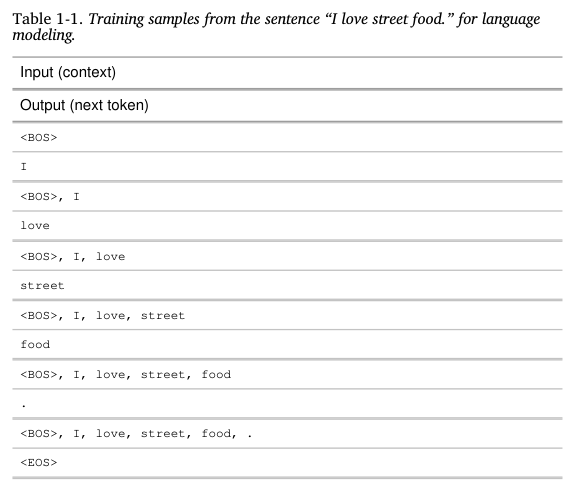

Trong Bảng 1-1, hai ký hiệu `<BOS>` và `<EOS>` được dùng để đánh dấu điểm **bắt đầu (Beginning Of Sequence)** và điểm **kết thúc (End Of Sequence)** của một chuỗi.

Các ký hiệu này rất cần thiết để một mô hình ngôn ngữ có thể làm việc với nhiều chuỗi văn bản khác nhau cùng lúc. Thông thường, mỗi ký hiệu này sẽ được mô hình xem như một "token đặc biệt" duy nhất.

Trong đó, ký hiệu kết thúc chuỗi (`<EOS>`) có vai trò đặc biệt quan trọng, vì nó chính là tín hiệu giúp mô hình ngôn ngữ biết khi nào cần phải dừng lại và kết thúc câu trả lời của mình.⁶

***

> **GHI CHÚ**
>
> **Học tự giám sát (Self-supervision)** và **học không giám sát (unsupervision)** là hai khái niệm khác nhau.
>
> *   Trong **học tự giám sát**, các nhãn (labels) được suy ra từ chính dữ liệu đầu vào.
> *   Trong **học không giám sát**, chúng ta hoàn toàn không cần đến nhãn.

***

Nhờ có phương pháp học tự giám sát, các mô hình ngôn ngữ có thể học hỏi từ các chuỗi văn bản mà không cần con người phải gán nhãn thủ công. Bởi vì văn bản có ở khắp mọi nơi—trong sách vở, các bài blog, báo chí, và cả những bình luận trên các diễn đàn—nên chúng ta có thể xây dựng được một kho dữ liệu huấn luyện khổng lồ. Chính điều này đã cho phép các mô hình ngôn ngữ được mở rộng quy mô để trở thành các **Mô hình Ngôn ngữ Lớn (Large Language Models - LLM)**.

Tuy nhiên, "Mô hình Ngôn ngữ Lớn" (LLM) lại không hẳn là một thuật ngữ khoa học chính xác. Một mô hình ngôn ngữ phải lớn đến đâu thì mới được coi là "lớn"? Thứ được coi là lớn hôm nay có thể sẽ bị xem là nhỏ bé vào ngày mai. Quy mô của một mô hình thường được đo bằng số lượng **tham số (parameters)** của nó. Một tham số là một biến số bên trong mô hình học máy, và giá trị của nó sẽ được cập nhật liên tục trong suốt quá trình huấn luyện.⁷ Nhìn chung, dù không phải lúc nào cũng đúng, một mô hình có càng nhiều tham số thì năng lực học hỏi các hành vi mong muốn của nó càng lớn.

Khi mô hình Generative Pre-trained Transformer (GPT) đầu tiên của OpenAI ra mắt vào tháng 6 năm 2018, nó có 117 triệu tham số, và con số đó đã được xem là lớn. Đến tháng 2 năm 2019, khi OpenAI giới thiệu GPT-2 với 1,5 tỷ tham số, thì con số 117 triệu đã bị "giáng cấp" xuống thành nhỏ. Tại thời điểm cuốn sách này được viết, một mô hình với 100 tỷ tham số được coi là lớn. Nhưng có lẽ một ngày nào đó, quy mô này cũng sẽ bị xem là nhỏ.

Trước khi chuyển sang phần tiếp theo, tôi muốn đề cập đến một câu hỏi thường bị xem là hiển nhiên: **Tại sao các mô hình lớn hơn lại cần nhiều dữ liệu hơn?** Câu trả lời là vì các mô hình lớn hơn có năng lực học hỏi lớn hơn, và do đó, chúng sẽ cần nhiều dữ liệu huấn luyện hơn để có thể phát huy tối đa hiệu suất của mình.⁸ Bạn cũng có thể huấn luyện một mô hình lớn trên một bộ dữ liệu nhỏ, nhưng làm vậy sẽ rất lãng phí tài nguyên tính toán (compute). Bạn hoàn toàn có thể đạt được kết quả tương tự hoặc thậm chí tốt hơn trên cùng bộ dữ liệu đó nếu sử dụng các mô hình nhỏ hơn.

***

### 1.3. Từ Mô hình Ngôn ngữ Lớn đến Mô hình Nền tảng

Mặc dù các mô hình ngôn ngữ có khả năng thực hiện những tác vụ đáng kinh ngạc, chúng lại bị giới hạn trong phạm vi **văn bản**. Là con người, chúng ta nhận thức thế giới không chỉ qua ngôn ngữ mà còn qua thị giác, thính giác, xúc giác, và nhiều giác quan khác. Để AI có thể hoạt động hiệu quả trong thế giới thực, việc có khả năng xử lý các loại dữ liệu khác ngoài văn bản là cực kỳ cần thiết.

Chính vì lý do này, các mô hình ngôn ngữ đang được mở rộng để có thể kết hợp thêm nhiều **dạng dữ liệu (data modalities)** khác. GPT-4V và Claude 3 có thể hiểu được cả hình ảnh và văn bản. Một số mô hình thậm chí còn có thể hiểu được video, các vật thể 3D, cấu trúc protein, v.v. Việc tích hợp thêm nhiều dạng dữ liệu vào các mô hình ngôn ngữ khiến chúng trở nên mạnh mẽ hơn nữa. Trong một tài liệu hệ thống về GPT-4V vào năm 2023, OpenAI đã lưu ý rằng "việc kết hợp thêm các phương thức khác (chẳng hạn như đầu vào là hình ảnh) vào các mô hình LLM được một số người xem là một trong những hướng đi tiên phong quan trọng trong nghiên cứu và phát triển AI."

Mặc dù nhiều người vẫn gọi Gemini và GPT-4V là các LLM, nhưng sẽ chính xác hơn nếu chúng ta gọi chúng là các **mô hình nền tảng (foundation models)**. Sở dĩ chúng được gọi là "nền tảng" là vì hai lý do: thứ nhất, nó nhấn mạnh tầm quan trọng của các mô hình này trong việc xây dựng các ứng dụng AI; và thứ hai, nó cho thấy rằng chúng có thể được dùng làm nền móng để xây dựng và tùy chỉnh cho các nhu cầu khác nhau.

Các mô hình nền tảng đánh dấu một bước đột phá so với cấu trúc nghiên cứu AI truyền thống. Trong một thời gian dài, lĩnh vực nghiên cứu AI bị phân chia rạch ròi theo từng dạng dữ liệu. Xử lý ngôn ngữ tự nhiên (NLP) chỉ giải quyết các vấn đề về văn bản. Thị giác máy tính (Computer vision) chỉ xử lý các vấn đề về hình ảnh. Các mô hình chỉ xử lý văn bản có thể được dùng cho các tác vụ như dịch thuật và phát hiện thư rác. Các mô hình chỉ xử lý hình ảnh có thể được dùng để nhận dạng vật thể và phân loại hình ảnh. Các mô hình chỉ xử lý âm thanh có thể đảm nhiệm việc nhận dạng giọng nói (chuyển giọng nói thành văn bản, STT) và tổng hợp giọng nói (chuyển văn bản thành giọng nói, TTS).

Một mô hình có thể làm việc với nhiều hơn một dạng dữ liệu được gọi là **mô hình đa phương thức (multimodal model)**. Một mô hình đa phương thức có khả năng tạo sinh còn được gọi là **Mô hình Đa phương thức Lớn (Large Multimodal Model - LMM)**. Nếu một mô hình ngôn ngữ thông thường dự đoán token tiếp theo chỉ dựa vào các token văn bản đã có trước đó, thì một mô hình đa phương thức sẽ dự đoán token tiếp theo dựa vào cả token văn bản và token hình ảnh, hoặc bất kỳ dạng dữ liệu nào khác mà mô hình đó hỗ trợ. Điều này được minh họa trong Hình 1-3.

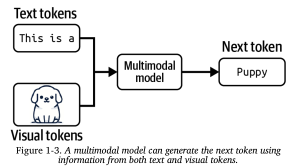

Cũng giống như các mô hình ngôn ngữ, các mô hình đa phương thức cần rất nhiều dữ liệu để có thể mở rộng quy mô. May mắn là, phương pháp **tự giám sát** cũng có thể áp dụng hiệu quả cho các mô hình đa phương thức.

Ví dụ, OpenAI đã sử dụng một biến thể của phương pháp tự giám sát được gọi là **"giám sát bằng ngôn ngữ tự nhiên" (natural language supervision)** để huấn luyện mô hình ngôn ngữ-hình ảnh của họ có tên là CLIP (công bố năm 2021). Thay vì phải thuê người gán nhãn thủ công cho từng tấm ảnh (ví dụ: gán nhãn "đây là con mèo"), họ đã tìm kiếm và thu thập các cặp (hình ảnh, văn bản) thường xuyên xuất hiện cùng nhau trên Internet. Ví dụ, một tấm ảnh về một chú mèo đi kèm với dòng chú thích "ảnh một chú mèo lông xù đang chơi đùa".

Bằng cách này, họ đã có thể tạo ra một bộ dữ liệu khổng lồ gồm 400 triệu cặp (hình ảnh, văn bản). Bộ dữ liệu này lớn gấp 400 lần so với ImageNet, và quan trọng nhất là không tốn một đồng chi phí nào cho việc gán nhãn thủ công.

Chính bộ dữ liệu khổng lồ này đã giúp CLIP trở thành mô hình đầu tiên có khả năng **"khái quát hóa" (generalize)**, tức là nó có thể thực hiện tốt nhiều tác vụ phân loại hình ảnh khác nhau mà không cần phải được huấn luyện lại một cách riêng biệt cho từng tác vụ.

***

> **GHI CHÚ**
>
> Trong cuốn sách này, thuật ngữ **"mô hình nền tảng" (foundation models)** sẽ được dùng để chỉ chung cho cả **"mô hình ngôn ngữ lớn" (large language models)** và **"mô hình đa phương thức lớn" (large multimodal models)**.
> 
***

Cần lưu ý rằng, CLIP không phải là một mô hình tạo sinh (generative model)—nó không được huấn luyện để tạo ra các kết quả có nội dung mở. CLIP là một **mô hình nhúng (embedding model)**, được huấn luyện để tạo ra các "bản nhúng" (embeddings) chung cho cả văn bản và hình ảnh.

Phần "Giới thiệu về Embedding" sẽ thảo luận chi tiết về khái niệm này. Còn bây giờ, bạn có thể tạm hình dung "bản nhúng" là những véctơ (một chuỗi các con số) được tạo ra nhằm mục đích nắm bắt và mã hóa ý nghĩa của dữ liệu gốc. Các mô hình nhúng đa phương thức như CLIP chính là "xương sống" cho các mô hình tạo sinh đa phương thức, chẳng hạn như Flamingo, LLaVA, và Gemini (trước đây là Bard).

Sự ra đời của các mô hình nền tảng cũng đánh dấu một bước chuyển mình quan trọng: từ các **mô hình chuyên dụng cho từng tác vụ (task-specific models)** sang các **mô hình đa năng (general-purpose models)**. Trước đây, các mô hình thường được phát triển để giải quyết một tác vụ cụ thể, ví dụ như phân tích cảm xúc hoặc dịch thuật. Một mô hình được huấn luyện để phân tích cảm xúc sẽ không thể nào làm được công việc dịch thuật, và ngược lại.

Ngày nay, nhờ vào quy mô khổng lồ và cách thức huấn luyện đặc biệt, các mô hình nền tảng có khả năng thực hiện một loạt các tác vụ vô cùng đa dạng. Ngay khi vừa "ra lò", các mô hình đa năng này đã có thể hoạt động tương đối tốt ở nhiều công việc khác nhau. Một mô hình LLM có thể vừa làm được phân tích cảm xúc, vừa làm được dịch thuật. Tuy nhiên, bạn vẫn thường có thể "tinh chỉnh" (tweak) một mô hình đa năng để tối đa hóa hiệu suất của nó cho một tác vụ cụ thể nào đó.

Hình 1-4 cho thấy các tác vụ được bộ kiểm chuẩn Super-NaturalInstructions sử dụng để đánh giá các mô hình nền tảng (Wang và cộng sự, 2022), qua đó giúp chúng ta hình dung về các loại công việc mà một mô hình nền tảng có thể thực hiện.

Bây giờ, hãy tưởng tượng bạn đang hợp tác với một nhà bán lẻ để xây dựng một ứng dụng chuyên tạo mô tả sản phẩm cho trang web của họ. Một mô hình đa năng có sẵn (out-of-the-box) có thể sẽ tạo ra được những mô tả chính xác về mặt thông tin, nhưng lại có thể thất bại trong việc nắm bắt được "giọng văn" (brand's voice) đặc trưng của thương hiệu, hoặc không làm nổi bật được những thông điệp mà thương hiệu muốn truyền tải.

Thậm chí, những đoạn mô tả được tạo ra có thể chứa đầy những lời lẽ quảng cáo sáo rỗng và rập khuôn.

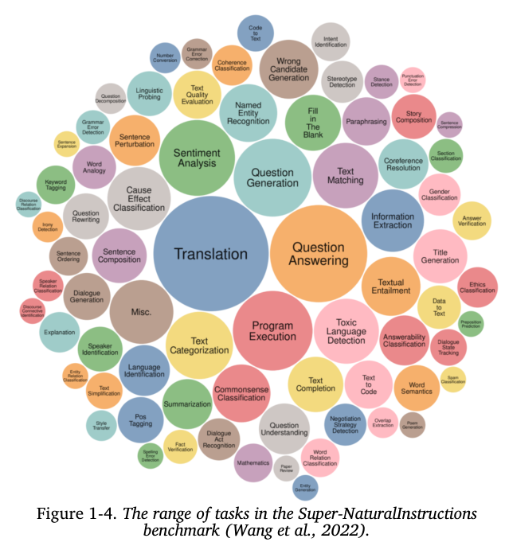

Có nhiều kỹ thuật khác nhau mà bạn có thể sử dụng để khiến mô hình tạo ra kết quả đúng theo ý bạn. Ví dụ, bạn có thể soạn thảo những chỉ dẫn chi tiết kèm theo các ví dụ về những mô tả sản phẩm mà bạn mong muốn. Phương pháp này được gọi là **kỹ thuật câu lệnh (prompt engineering)**.

Bạn cũng có thể kết nối mô hình với một cơ sở dữ liệu chứa các đánh giá của khách hàng để mô hình có thể tận dụng nguồn thông tin này và tạo ra các mô tả tốt hơn. Việc sử dụng một cơ sở dữ liệu để bổ sung thông tin cho các chỉ dẫn được gọi là **sinh tạo tăng cường truy xuất (retrieval-augmented generation - RAG)**.

Ngoài ra, bạn cũng có thể **tinh chỉnh (finetune)**—tức là huấn luyện thêm—cho mô hình dựa trên một bộ dữ liệu gồm những mô tả sản phẩm chất lượng cao.

Kỹ thuật câu lệnh, RAG, và tinh chỉnh là ba kỹ thuật rất phổ biến trong ngành Kỹ thuật AI mà bạn có thể dùng để điều chỉnh một mô hình cho phù hợp với nhu cầu của mình. Phần còn lại của cuốn sách sẽ thảo luận chi tiết về cả ba kỹ thuật này.

Việc điều chỉnh một mô hình mạnh mẽ có sẵn cho tác vụ của bạn nhìn chung sẽ dễ dàng hơn rất nhiều so với việc xây dựng một mô hình từ con số không—ví dụ, chỉ cần mười ví dụ và một cuối tuần so với một triệu ví dụ và sáu tháng. Các mô hình nền tảng giúp cho việc phát triển các ứng dụng AI trở nên rẻ hơn và rút ngắn thời gian đưa sản phẩm ra thị trường. Lượng dữ liệu chính xác cần thiết để điều chỉnh một mô hình sẽ phụ thuộc vào kỹ thuật mà bạn sử dụng. Cuốn sách này cũng sẽ đề cập đến vấn đề này khi thảo luận về từng kỹ thuật.

Tuy nhiên, các mô hình chuyên dụng cho từng tác vụ vẫn có nhiều ưu điểm riêng, chẳng hạn như chúng có thể nhỏ hơn rất nhiều, giúp cho việc sử dụng chúng nhanh hơn và tiết kiệm chi phí hơn.

Việc nên tự xây dựng mô hình của riêng mình hay tận dụng một mô hình đã có sẵn là một câu hỏi kinh điển về "mua hay tự xây" (buy-or-build) mà các đội nhóm sẽ phải tự mình đưa ra câu trả lời. Những phân tích xuyên suốt cuốn sách này có thể giúp bạn đưa ra quyết định đó.

### 1.4. Từ Mô hình Nền tảng đến Kỹ thuật AI

**Kỹ thuật AI (AI Engineering)** là quá trình xây dựng các ứng dụng dựa trên các mô hình nền tảng. Thực ra, việc xây dựng ứng dụng AI đã diễn ra hơn một thập kỷ nay, và quy trình đó thường được biết đến với tên gọi là **Kỹ thuật Học máy (ML Engineering)** hoặc **MLOps** (viết tắt của Vận hành Học máy - ML Operations). Vậy tại sao bây giờ chúng ta lại nói về Kỹ thuật AI?

Điểm khác biệt cốt lõi là: nếu như Kỹ thuật Học máy truyền thống tập trung vào việc *tự phát triển* các mô hình học máy, thì Kỹ thuật AI lại *tận dụng* những mô hình đã có sẵn.

Sự sẵn có và khả năng tiếp cận dễ dàng của các mô hình nền tảng mạnh mẽ đã dẫn đến ba yếu tố. Ba yếu tố này, khi kết hợp lại, đã tạo ra những điều kiện lý tưởng cho sự phát triển nhanh chóng của Kỹ thuật AI như một lĩnh vực riêng:

#### Yếu tố 1: Khả năng đa năng của AI

Sức mạnh của các mô hình nền tảng không chỉ nằm ở chỗ chúng có thể thực hiện các công việc hiện có một cách tốt hơn, mà còn đến từ việc chúng có thể đảm nhiệm được **nhiều loại công việc hơn**. Những ứng dụng mà trước đây chúng ta cho là bất khả thi giờ đã trở nên khả thi, và những ứng dụng chưa từng được ai nghĩ đến trước đây thì nay đang dần xuất hiện. Thậm chí, những ứng dụng mà hôm nay chúng ta nghĩ là không thể có thể sẽ trở thành hiện thực vào ngày mai. Điều này làm cho AI trở nên hữu ích hơn trong nhiều khía cạnh của cuộc sống, từ đó làm tăng vọt cả lượng người dùng và nhu cầu đối với các ứng dụng AI.

Ví dụ, vì AI giờ đây có thể viết tốt như con người, đôi khi còn tốt hơn, nên nó có thể tự động hóa hoặc bán tự động hóa mọi công việc đòi hỏi giao tiếp, mà về cơ bản đó là gần như mọi thứ. AI đang được sử dụng để viết email, phản hồi yêu cầu của khách hàng, và giải thích các hợp đồng phức tạp. Bất kỳ ai có máy tính đều có thể truy cập các công cụ có khả năng tạo ra ngay lập tức những hình ảnh và video chất lượng cao được tùy chỉnh theo ý muốn, giúp tạo ra các tài liệu tiếp thị, chỉnh sửa ảnh chân dung chuyên nghiệp, hình dung hóa các ý tưởng nghệ thuật, minh họa sách, v.v. AI thậm chí có thể được dùng để tổng hợp dữ liệu huấn luyện, phát triển thuật toán, và viết mã, tất cả những điều này sẽ giúp huấn luyện các mô hình mạnh mẽ hơn nữa trong tương lai.

#### Yếu tố 2: Sự gia tăng các khoản đầu tư vào AI

Thành công của ChatGPT đã thúc đẩy một sự gia tăng mạnh mẽ trong các khoản đầu tư vào AI, đến từ cả các nhà đầu tư mạo hiểm và các doanh nghiệp lớn. Khi các ứng dụng AI ngày càng rẻ hơn để xây dựng và nhanh hơn để đưa ra thị trường, lợi tức đầu tư cho AI cũng trở nên hấp dẫn hơn. Các công ty đang đổ xô tích hợp AI vào sản phẩm và quy trình hoạt động của họ. Matt Ross, một quản lý cấp cao về nghiên cứu ứng dụng tại Scribd, đã chia sẻ với tôi rằng chi phí AI ước tính cho các trường hợp sử dụng của ông đã giảm đi hai bậc độ lớn (tức là giảm 100 lần) chỉ trong khoảng thời gian từ tháng 4 năm 2022 đến tháng 4 năm 2023.

Nghiên cứu của Goldman Sachs ước tính rằng đầu tư vào AI có thể đạt gần 100 tỷ đô la ở Mỹ và 200 tỷ đô la trên toàn cầu vào năm 2025.⁹ AI thường được nhắc đến như một lợi thế cạnh tranh. FactSet đã phát hiện ra rằng cứ ba công ty trong danh sách S&P 500 thì có một công ty đề cập đến AI trong các cuộc họp báo cáo thu nhập vào quý hai năm 2023, con số này nhiều gấp ba lần so với một năm trước đó. Hình 1-5 cho thấy số lượng các công ty S&P 500 đã đề cập đến AI trong các cuộc họp báo cáo thu nhập của họ từ năm 2018 đến 2023.

Theo WallStreetZen, các công ty đề cập đến AI trong các cuộc họp báo cáo thu nhập đã chứng kiến giá cổ phiếu của họ tăng nhiều hơn so với những công ty không đề cập: mức tăng trung bình là 4,6% so với 2,4%. Hiện vẫn chưa rõ đây là mối quan hệ nhân quả (việc sử dụng AI thực sự khiến các công ty này thành công hơn) hay chỉ là một mối tương quan (các công ty này vốn đã thành công vì họ nhanh nhạy trong việc thích ứng với các công nghệ mới).

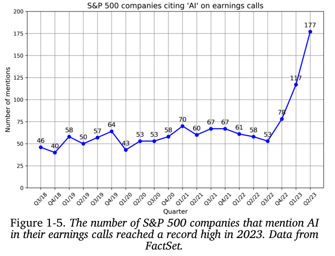

#### Yếu tố 3: Rào cản gia nhập thấp trong việc xây dựng ứng dụng AI

Phương pháp **"mô hình như một dịch vụ" (model as a service)**, được phổ biến bởi OpenAI và các nhà cung cấp mô hình khác, đã giúp cho việc tận dụng AI để xây dựng ứng dụng trở nên dễ dàng hơn bao giờ hết. Theo phương pháp này, các mô hình được cung cấp thông qua các API, có chức năng nhận yêu cầu từ người dùng và trả về kết quả của mô hình. Nếu không có các API này, việc sử dụng một mô hình AI đòi hỏi bạn phải có cả một cơ sở hạ tầng để lưu trữ và vận hành mô hình đó. Các API này cho phép bạn truy cập vào những mô hình mạnh mẽ chỉ bằng những lời gọi API đơn giản.

Không chỉ vậy, AI còn giúp cho việc xây dựng ứng dụng chỉ cần đến **rất ít kỹ năng lập trình**.

*   Thứ nhất, AI có thể **viết mã thay cho bạn**, cho phép những người không có nền tảng về kỹ thuật phần mềm có thể nhanh chóng biến ý tưởng của họ thành mã lệnh và đưa sản phẩm đến tay người dùng.
*   Thứ hai, bạn có thể làm việc với các mô hình này bằng **ngôn ngữ giao tiếp hàng ngày** thay vì phải sử dụng một ngôn ngữ lập trình phức tạp.

Bất kỳ ai, và tôi thực sự muốn nhấn mạnh là **bất kỳ ai**, giờ đây cũng đều có thể phát triển các ứng dụng AI.

***

Bởi vì việc phát triển các mô hình nền tảng đòi hỏi một nguồn lực khổng lồ, quy trình này chỉ khả thi đối với các tập đoàn lớn (như Google, Meta, Microsoft, Baidu, Tencent), các chính phủ (như Nhật Bản, Các Tiểu vương quốc Ả Rập Thống nhất), và các công ty khởi nghiệp đầy tham vọng và được đầu tư mạnh mẽ (như OpenAI, Anthropic, Mistral). Trong một cuộc phỏng vấn vào tháng 9 năm 2022, Sam Altman, CEO của OpenAI, đã nói rằng cơ hội lớn nhất cho đại đa số mọi người sẽ là việc điều chỉnh các mô hình này cho các ứng dụng cụ thể.

Và thế giới đã nhanh chóng nắm bắt cơ hội này. Kỹ thuật AI đã nhanh chóng nổi lên như một trong những lĩnh vực kỹ thuật phát triển nhanh nhất, và rất có thể là nhanh nhất từ trước đến nay. Các công cụ dành cho Kỹ thuật AI đang thu hút sự chú ý nhanh hơn bất kỳ công cụ kỹ thuật phần mềm nào trước đó. Chỉ trong vòng hai năm, bốn công cụ Kỹ thuật AI mã nguồn mở (AutoGPT, Stable Diffusion Web UI, LangChain, Ollama) đã thu về nhiều "sao" (stars) trên GitHub hơn cả Bitcoin. Chúng đang trên đà vượt qua cả những framework phát triển web phổ biến nhất, bao gồm React và Vue, về số lượng sao. Hình 1-6 cho thấy sự tăng trưởng về số sao trên GitHub của các công cụ Kỹ thuật AI so với Bitcoin, Vue, và React.

Một khảo sát của LinkedIn từ tháng 8 năm 2023 cho thấy số lượng chuyên gia thêm các thuật ngữ như “Generative AI,” “ChatGPT,” “Prompt Engineering,” và “Prompt Crafting” vào hồ sơ của họ đã tăng trung bình 75% mỗi tháng.

Tạp chí ComputerWorld thậm chí đã tuyên bố rằng "dạy AI cách hành xử là kỹ năng nghề nghiệp phát triển nhanh nhất".

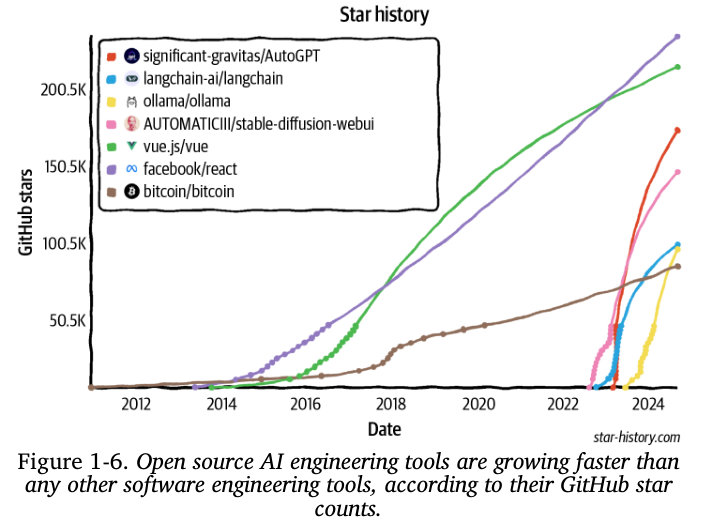

> ### Tại sao lại dùng thuật ngữ "Kỹ thuật AI"?
>
> Hiện có rất nhiều thuật ngữ đang được sử dụng để mô tả quá trình xây dựng ứng dụng dựa trên các mô hình nền tảng, bao gồm *Kỹ thuật Học máy (ML engineering)*, *MLOps*, *AIOps*, *LLMOps*, v.v. Vậy tại sao tôi lại chọn dùng thuật ngữ **Kỹ thuật AI (AI engineering)** cho cuốn sách này?
>
> *   Tôi không chọn thuật ngữ "Kỹ thuật Học máy" bởi vì, như sẽ được thảo luận trong phần "So sánh Kỹ thuật AI và Kỹ thuật Học máy", việc làm việc với các mô hình nền tảng có nhiều điểm khác biệt quan trọng so với việc làm việc với các mô hình học máy truyền thống. Thuật ngữ "Kỹ thuật Học máy" sẽ không đủ để thể hiện rõ sự khác biệt này. Tuy nhiên, "Kỹ thuật Học máy" lại là một thuật ngữ rất hay nếu muốn bao hàm cả hai quy trình.
>
> *   Tôi cũng không chọn các thuật ngữ có đuôi "Ops" (ám chỉ việc Vận hành) vì, mặc dù quy trình này có các yếu taố liên quan đến vận hành, nhưng trọng tâm lại nằm nhiều hơn ở việc "tinh chỉnh" (engineering - kỹ thuật) các mô hình nền tảng để chúng làm theo điều bạn muốn.
>
> *   Cuối cùng, tôi đã thực hiện một cuộc khảo sát với 20 người đang phát triển ứng dụng dựa trên các mô hình nền tảng về thuật ngữ mà họ sẽ dùng để mô tả công việc của mình. Hầu hết mọi người đều thích thuật ngữ "Kỹ thuật AI". Vì vậy, tôi đã quyết định đi theo số đông.

Cộng đồng kỹ sư AI, vốn đang phát triển một cách nhanh chóng, đã thể hiện sự sáng tạo đáng kinh ngạc qua hàng loạt các ứng dụng vô cùng thú vị. Trong phần tiếp theo, chúng ta sẽ cùng tìm hiểu về một số mô hình ứng dụng phổ biến nhất trong số đó.

## 2. Các Trường hợp sử dụng Phổ biến của Mô hình Nền tảng

Nếu bạn chưa bắt đầu xây dựng các ứng dụng AI, tôi hy vọng phần trước đã thuyết phục được bạn rằng bây giờ chính là thời điểm tuyệt vời để làm điều đó. Nếu bạn đã có sẵn một ý tưởng ứng dụng trong đầu, bạn có thể muốn chuyển thẳng đến phần "Lập kế hoạch cho Ứng dụng AI". Còn nếu bạn đang tìm kiếm nguồn cảm hứng, phần này sẽ giới thiệu một loạt các trường hợp sử dụng đầy hứa hẹn và đã được ngành công nghiệp chứng minh hiệu quả.

Số lượng các ứng dụng tiềm năng mà bạn có thể xây dựng với các mô hình nền tảng dường như là vô tận. Dù bạn nghĩ đến trường hợp sử dụng nào, gần như chắc chắn đã có một AI dành cho việc đó.¹⁰ Việc liệt kê tất cả các trường hợp sử dụng tiềm năng của AI là điều không thể.

Ngay cả việc cố gắng phân loại các trường hợp sử dụng này cũng là một thách thức, vì các cuộc khảo sát khác nhau lại sử dụng những cách phân loại khác nhau. Ví dụ, Amazon Web Services (AWS) đã phân loại các trường hợp sử dụng AI tạo sinh trong doanh nghiệp thành ba nhóm chính: **trải nghiệm khách hàng, năng suất của nhân viên, và tối ưu hóa quy trình**. Một cuộc khảo sát năm 2024 của O'Reilly lại phân loại chúng thành tám hạng mục: **lập trình, phân tích dữ liệu, hỗ trợ khách hàng, viết nội dung quảng cáo, các loại nội dung viết khác, nghiên cứu, thiết kế web, và nghệ thuật**.

Một số tổ chức, như Deloitte, lại phân loại các trường hợp sử dụng theo **cách thức tạo ra giá trị**, chẳng hạn như **giảm chi phí, tăng hiệu quả quy trình, tăng trưởng, và thúc đẩy đổi mới**. Về mặt tạo ra giá trị, công ty Gartner còn có một hạng mục dành cho **tính liên tục trong kinh doanh (business continuity)**, nghĩa là một tổ chức có thể sẽ phá sản nếu không áp dụng AI tạo sinh. Trong số 2.500 giám đốc điều hành mà Gartner khảo sát vào năm 2023, 7% đã cho rằng tính liên tục trong kinh doanh là động lực thúc đẩy họ áp dụng AI tạo sinh.

Nghiên cứu của Eloundou và cộng sự (2023) đã phân tích rất xuất sắc về mức độ "ảnh hưởng" của AI đối với các ngành nghề khác nhau. Họ định nghĩa một công việc là "bị ảnh hưởng" nếu AI và các phần mềm do AI cung cấp có thể **giảm thời gian cần thiết để hoàn thành công việc đó ít nhất là 50%**. Một ngành nghề có mức độ ảnh hưởng là 80% có nghĩa là 80% các công việc trong ngành nghề đó bị ảnh hưởng.

Theo nghiên cứu này, các ngành nghề có mức độ ảnh hưởng là 100% hoặc gần 100% bao gồm phiên dịch viên và biên dịch viên, người khai thuế, nhà thiết kế web, và nhà văn. Một số trong số đó được trình bày trong Bảng 1-2. Không có gì đáng ngạc nhiên, các ngành nghề không bị AI ảnh hưởng bao gồm đầu bếp, thợ xây đá, và vận động viên. Nghiên cứu này cho chúng ta một ý tưởng rất hay về những trường hợp sử dụng mà AI có thể làm tốt.

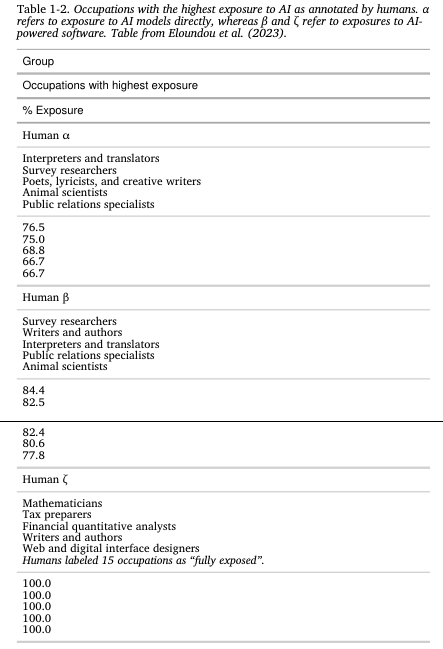

Khi phân tích các trường hợp sử dụng, tôi đã xem xét cả những ứng dụng dành cho doanh nghiệp và những ứng dụng dành cho người tiêu dùng cá nhân.

*   Để hiểu về các trường hợp sử dụng trong doanh nghiệp, tôi đã phỏng vấn 50 công ty về chiến lược AI của họ và đọc hơn 100 nghiên cứu tình huống (case studies).
*   Để hiểu về các ứng dụng dành cho người tiêu dùng, tôi đã xem xét 205 ứng dụng AI mã nguồn mở có ít nhất 500 sao trên GitHub.¹¹

Sau đó, tôi đã phân loại các ứng dụng này thành tám nhóm, như được trình bày trong Bảng 1-3. Danh sách này chỉ nên được xem như một tài liệu tham khảo. Khi bạn tìm hiểu thêm về cách xây dựng các mô hình nền tảng ở Chương 2 và cách đánh giá chúng ở Chương 3, bạn cũng sẽ tự mình hình dung được một bức tranh rõ ràng hơn về những trường hợp sử dụng mà các mô hình nền tảng có thể và nên được áp dụng.

Table 1-3. Common generative AI use cases across consumer and enterprise
applications.
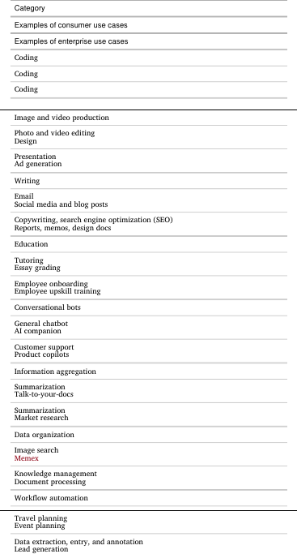

Bởi vì các mô hình nền tảng có tính đa năng, các ứng dụng được xây dựng dựa trên chúng có thể giải quyết được rất nhiều vấn đề khác nhau. Điều này cũng có nghĩa là một ứng dụng có thể được xếp vào nhiều hơn một hạng mục. Ví dụ, một con bot có thể vừa làm bạn đồng hành, vừa tổng hợp thông tin. Một ứng dụng khác lại có thể giúp bạn trích xuất dữ liệu có cấu trúc từ một tệp PDF và đồng thời trả lời các câu hỏi về nội dung của tệp PDF đó.

Hình 1-7 cho thấy sự phân bổ của các trường hợp sử dụng này trong số 205 ứng dụng mã nguồn mở đã được khảo sát. Cần lưu ý rằng, việc các trường hợp sử dụng liên quan đến giáo dục, tổ chức dữ liệu, và viết lách chỉ chiếm một tỷ lệ phần trăm nhỏ **không có nghĩa là chúng không phổ biến**.

Điều đó chỉ đơn giản có nghĩa là các ứng dụng thuộc nhóm này thường không phải là mã nguồn mở. Có thể là vì những người xây dựng các ứng dụng này nhận thấy chúng phù hợp hơn cho các mục đích sử dụng trong doanh nghiệp.

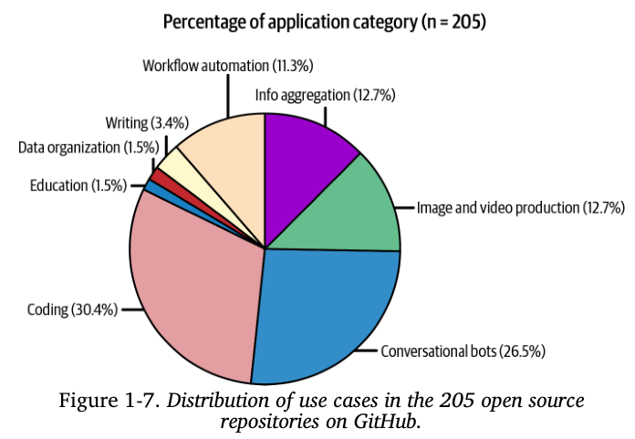

Thế giới doanh nghiệp nhìn chung thường ưa thích các ứng dụng có rủi ro thấp hơn. Ví dụ, một báo cáo Tăng trưởng năm 2024 của a16z đã chỉ ra rằng các công ty thường triển khai các **ứng dụng phục vụ nội bộ** (internal-facing applications), chẳng hạn như hệ thống quản lý kiến thức nội bộ, nhanh hơn so với các **ứng dụng phục vụ bên ngoài** (external-facing applications), như chatbot hỗ trợ khách hàng. Điều này được minh họa trong Hình 1-8.

Việc triển khai các ứng dụng nội bộ giúp các công ty vừa có thể phát triển chuyên môn về Kỹ thuật AI của mình, vừa giảm thiểu được các rủi ro liên quan đến quyền riêng tư dữ liệu, tuân thủ quy định và các sự cố nghiêm trọng có thể xảy ra.

Tương tự như vậy, mặc dù các mô hình nền tảng có tính "mở" (open-ended) và có thể được sử dụng cho bất kỳ tác vụ nào, nhiều ứng dụng được xây dựng dựa trên chúng vẫn có tính "đóng" (close-ended), ví dụ như các tác vụ phân loại. Lý do là vì các tác vụ phân loại thường dễ đánh giá hơn, điều này giúp cho việc ước tính rủi ro của chúng cũng trở nên dễ dàng hơn.

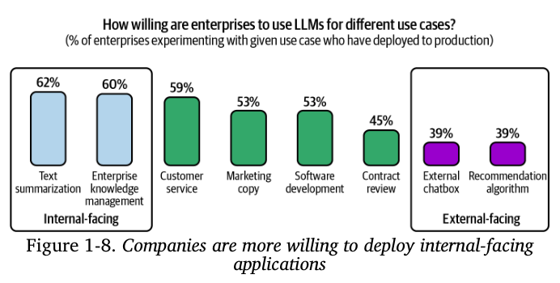

Ngay cả sau khi đã chứng kiến hàng trăm ứng dụng AI ra đời, tôi vẫn tìm thấy những ứng dụng mới khiến tôi phải bất ngờ mỗi tuần.

Vào những ngày đầu của Internet, ít ai có thể ngờ rằng ứng dụng chiếm ưu thế nhất trên mạng một ngày nào đó lại chính là mạng xã hội. Tương tự như vậy, khi chúng ta dần học được cách tận dụng tối đa sức mạnh của AI, ứng dụng mà cuối cùng sẽ chiếm ưu thế rất có thể sẽ khiến tất cả chúng ta phải ngạc nhiên.

Hy vọng rằng, sự bất ngờ đó sẽ là một điều tốt đẹp.

### 2.1 Lập trình

Trong rất nhiều cuộc khảo sát về AI tạo sinh, lập trình chắc chắn là trường hợp sử dụng phổ biến nhất. Các công cụ lập trình AI trở nên phổ biến là vì hai lý do: thứ nhất, AI rất giỏi trong việc lập trình, và thứ hai, những kỹ sư AI đời đầu cũng chính là các lập trình viên, nên họ là những người tiếp xúc nhiều nhất với các thách thức trong công việc này.

Một trong những thành công sớm nhất của các mô hình nền tảng khi được đưa vào sử dụng thực tế chính là công cụ hoàn thiện mã lệnh GitHub Copilot. Doanh thu định kỳ hàng năm của công cụ này đã vượt mốc 100 triệu đô la chỉ sau hai năm ra mắt. Tại thời điểm viết cuốn sách này, các công ty khởi nghiệp về lập trình được hỗ trợ bởi AI đã huy động được hàng trăm triệu đô la, trong đó Magic huy động được 320 triệu đô la và Anysphere huy động được 60 triệu đô la, cả hai đều diễn ra vào tháng 8 năm 2024. Các công cụ lập trình mã nguồn mở như gpt-engineer và screenshot-to-code đều nhận được 50.000 sao trên GitHub chỉ trong vòng một năm, và còn nhiều công cụ khác đang được ra mắt một cách nhanh chóng.

Ngoài các công cụ giúp hỗ trợ lập trình nói chung, có nhiều công cụ khác chuyên về các tác vụ lập trình cụ thể. Dưới đây là ví dụ về các tác vụ đó:

*   **Trích xuất dữ liệu có cấu trúc** từ các trang web và tệp PDF (AgentGPT)
*   **Chuyển đổi từ ngôn ngữ tự nhiên sang mã lệnh** (DB-GPT, SQL Chat, PandasAI)
*   Từ một bản thiết kế hoặc ảnh chụp màn hình, **tạo ra mã lệnh để dựng nên một trang web trông giống hệt như hình ảnh đã cho** (screenshot-to-code, draw-a-ui)
*   **Chuyển đổi từ một ngôn ngữ hoặc framework lập trình này sang một ngôn ngữ hoặc framework khác** (GPT-Migrate, AI Code Translator)
*   **Viết tài liệu kỹ thuật** (Autodoc)
*   **Tạo ra các bài kiểm thử** (PentestGPT)
*   **Tạo ra các thông điệp commit** (AI Commits)

Rõ ràng là AI có thể đảm nhiệm nhiều công việc trong ngành kỹ thuật phần mềm. Câu hỏi đặt ra là, liệu AI có thể tự động hóa *hoàn toàn* ngành này hay không?

Ở một thái cực, Jensen Huang, CEO của NVIDIA, dự đoán rằng AI sẽ thay thế các kỹ sư phần mềm con người và chúng ta nên ngừng việc khuyến khích trẻ em học lập trình. Trong một đoạn ghi âm bị rò rỉ, CEO của AWS là Matt Garman cũng chia sẻ rằng trong tương lai gần, hầu hết các lập trình viên sẽ ngừng viết mã. Ông không có ý nói rằng đó là dấu chấm hết cho các nhà phát triển phần mềm; chỉ là công việc của họ sẽ thay đổi.

Ở thái cực còn lại, có rất nhiều kỹ sư phần mềm tin chắc rằng họ sẽ không bao giờ bị AI thay thế, vì cả lý do kỹ thuật lẫn lý do cảm tính (con người thường không thích thừa nhận rằng mình có thể bị thay thế).

Kỹ thuật phần mềm bao gồm rất nhiều tác vụ. AI làm tốt một số việc hơn những việc khác. Các nhà nghiên cứu của McKinsey đã phát hiện ra rằng AI có thể giúp các lập trình viên tăng năng suất lên gấp đôi đối với công việc viết tài liệu, và tăng từ 25-50% đối với việc tạo mã và tái cấu trúc mã. Tuy nhiên, mức độ cải thiện năng suất quan sát được là rất nhỏ đối với các tác vụ có độ phức tạp cao, như được trình bày trong Hình 1-9. Trong các cuộc trò chuyện của tôi với những người phát triển các công cụ lập trình AI, nhiều người đã nói với tôi rằng họ nhận thấy AI giỏi hơn nhiều trong việc phát triển frontend (phần giao diện người dùng) so với phát triển backend (phần xử lý logic).

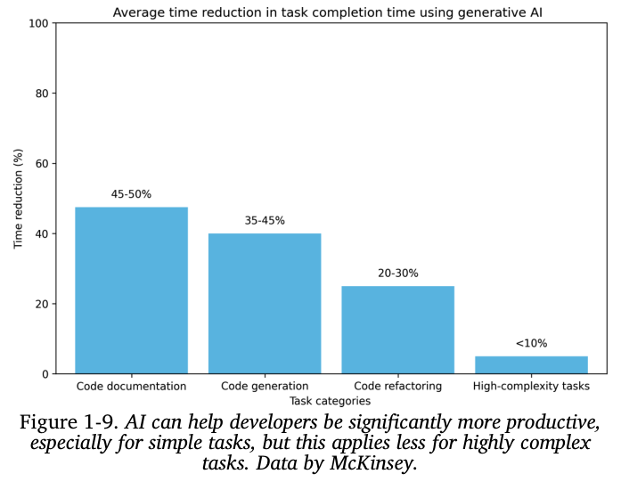

Bất kể liệu AI có thay thế các kỹ sư phần mềm hay không, thì có một điều chắc chắn là AI có thể giúp họ làm việc năng suất hơn. Điều này có nghĩa là các công ty giờ đây có thể hoàn thành được nhiều việc hơn với một đội ngũ kỹ sư ít hơn.

AI cũng có thể gây ra những biến động lớn cho ngành gia công phần mềm (outsourcing), bởi vì các công việc được thuê ngoài thường là những tác vụ đơn giản hơn, không thuộc về mảng kinh doanh cốt lõi của công ty.

### 2.2 Sản xuất Hình ảnh và Video

Nhờ vào bản chất hoạt động dựa trên xác suất, AI rất giỏi trong các công việc đòi hỏi sự sáng tạo. Một vài trong số những công ty khởi nghiệp về AI thành công nhất chính là các ứng dụng sáng tạo, chẳng hạn như Midjourney chuyên tạo hình ảnh, Adobe Firefly chuyên chỉnh sửa ảnh, và Runway, Pika Labs, hay Sora chuyên tạo video. Vào cuối năm 2023, chỉ sau một năm rưỡi hoạt động, Midjourney đã đạt được mức doanh thu định kỳ hàng năm là 200 triệu đô la.

Tính đến tháng 12 năm 2023, trong số 10 ứng dụng miễn phí hàng đầu thuộc danh mục Đồ họa & Thiết kế trên Apple App Store, một nửa có chứa từ "AI" trong tên của chúng. Tôi nghi ngờ rằng chẳng bao lâu nữa, các ứng dụng đồ họa và thiết kế sẽ tích hợp AI như một tính năng mặc định, và khi đó chúng sẽ không cần phải thêm từ "AI" vào tên gọi nữa. Chương 2 sẽ thảo luận chi tiết hơn về bản chất hoạt động dựa trên xác suất của AI.

Việc sử dụng AI để tạo ảnh đại diện cho các mạng xã hội, từ LinkedIn đến TikTok, giờ đây đã trở nên rất phổ biến. Nhiều ứng viên tin rằng những tấm ảnh chân dung do AI tạo ra có thể giúp họ thể hiện hình ảnh tốt nhất của mình và tăng cơ hội tìm được việc làm. Nhận thức về ảnh đại diện do AI tạo ra đã thay đổi một cách đáng kể. Vào năm 2019, Facebook đã cấm các tài khoản sử dụng ảnh đại diện do AI tạo ra vì lý do an toàn. Đến năm 2023, nhiều ứng dụng mạng xã hội đã tự cung cấp các công cụ cho phép người dùng sử dụng AI để tạo ảnh đại diện.

Đối với các doanh nghiệp, lĩnh vực quảng cáo và tiếp thị đã nhanh chóng tích hợp AI.¹² AI có thể được sử dụng để trực tiếp tạo ra các hình ảnh và video quảng cáo. Nó có thể giúp khởi tạo ý tưởng hoặc tạo ra các bản nháp đầu tiên để các chuyên gia con người dựa vào đó chỉnh sửa và hoàn thiện. Bạn có thể sử dụng AI để tạo ra nhiều phiên bản quảng cáo khác nhau và thử nghiệm xem phiên bản nào hoạt động tốt nhất với khán giả. AI cũng có thể tạo ra các biến thể của quảng cáo tùy theo mùa và địa điểm. Ví dụ, bạn có thể dùng AI để thay đổi màu lá cây trong quảng cáo vào mùa thu hoặc thêm tuyết phủ trên mặt đất vào mùa đông.

### 2.3 Viết lách

AI từ lâu đã được sử dụng để hỗ trợ việc viết lách. Nếu bạn dùng điện thoại thông minh, chắc hẳn bạn đã quen thuộc với tính năng tự động sửa lỗi (autocorrect) và tự động hoàn thành (auto-completion), cả hai đều được vận hành bởi AI. Viết lách là một ứng dụng lý tưởng cho AI vì chúng ta làm việc này rất nhiều, nó có thể khá tẻ nhạt, và chúng ta có mức độ chấp nhận sai sót khá cao. Nếu một mô hình gợi ý điều gì đó mà bạn không thích, bạn chỉ cần bỏ qua nó.

Không có gì ngạc nhiên khi các mô hình LLM rất giỏi viết lách, vì chúng vốn được huấn luyện để hoàn thiện văn bản. Để nghiên cứu tác động của ChatGPT đối với việc viết lách, một nghiên cứu của MIT (Noy và Zhang, 2023) đã giao các bài tập viết chuyên môn cho 453 chuyên gia có trình độ đại học và cho một nửa trong số họ tiếp xúc ngẫu nhiên với ChatGPT. Kết quả của họ cho thấy rằng trong nhóm được tiếp xúc với ChatGPT, thời gian hoàn thành công việc trung bình đã giảm 40% và chất lượng sản phẩm đầu ra tăng 18%. ChatGPT giúp thu hẹp khoảng cách về chất lượng sản phẩm giữa các nhân viên, điều này có nghĩa là nó hữu ích hơn đối với những người không có thiên hướng viết lách. Những nhân viên được tiếp xúc với ChatGPT trong thí nghiệm có khả năng báo cáo rằng họ đã sử dụng nó trong công việc thực tế cao gấp 2 lần sau hai tuần kể từ khi thí nghiệm kết thúc, và cao gấp 1.6 lần sau hai tháng.

Đối với người tiêu dùng cá nhân, các trường hợp sử dụng là rất rõ ràng. Nhiều người dùng AI để giúp họ giao tiếp tốt hơn. Bạn có thể viết một email với giọng điệu tức giận và yêu cầu AI sửa lại cho nó trở nên dễ chịu hơn. Bạn có thể cung cấp cho nó các gạch đầu dòng và nhận lại những đoạn văn hoàn chỉnh. Nhiều người cho biết họ không còn gửi một email quan trọng nào mà không nhờ AI cải thiện nó trước.

Sinh viên đang dùng AI để viết luận. Các nhà văn đang dùng AI để viết sách.¹³ Nhiều công ty khởi nghiệp đã và đang sử dụng AI để tạo ra các cuốn sách dành cho trẻ em, truyện của người hâm mộ (fan fiction), truyện lãng mạn và truyện giả tưởng. Không giống như những cuốn sách truyền thống, những cuốn sách do AI tạo ra có thể có tính tương tác, vì cốt truyện của sách có thể thay đổi tùy theo sở thích của người đọc. Điều này có nghĩa là độc giả có thể chủ động tham gia vào việc sáng tạo câu chuyện mà họ đang đọc. Một ứng dụng đọc sách cho trẻ em có thể xác định những từ mà một đứa trẻ gặp khó khăn và tự động tạo ra những câu chuyện xoay quanh những từ đó.

Các ứng dụng ghi chú và email như Google Docs, Notion, và Gmail đều sử dụng AI để giúp người dùng cải thiện bài viết của mình. Grammarly, một ứng dụng trợ lý viết lách, đã tinh chỉnh một mô hình riêng để giúp cho bài viết của người dùng trở nên trôi chảy, mạch lạc và rõ ràng hơn.

Khả năng viết lách của AI cũng có thể bị lạm dụng. Vào năm 2023, tờ New York Times đã đưa tin rằng Amazon bị tràn ngập bởi những cuốn sách hướng dẫn du lịch chất lượng kém do AI tạo ra, mỗi cuốn đều đi kèm với tiểu sử tác giả, một trang web, và những bài đánh giá có cánh, tất cả đều do AI tạo ra.

Đối với doanh nghiệp, việc dùng AI để viết lách là rất phổ biến trong các lĩnh vực bán hàng, tiếp thị, và giao tiếp nội bộ. Nhiều nhà quản lý nói với tôi rằng họ đã và đang sử dụng AI để giúp họ viết báo cáo hiệu suất công việc. AI có thể giúp soạn thảo các email tiếp cận khách hàng tiềm năng một cách hiệu quả, viết nội dung quảng cáo, và mô tả sản phẩm. Các ứng dụng quản lý quan hệ khách hàng (CRM) như HubSpot và Salesforce cũng có các công cụ cho người dùng doanh nghiệp để tạo nội dung web và email tiếp cận khách hàng.

AI dường như đặc biệt giỏi về SEO, có lẽ vì nhiều mô hình AI được huấn luyện với dữ liệu từ Internet, một nơi vốn đã có rất nhiều văn bản được tối ưu hóa cho SEO. AI giỏi SEO đến mức nó đã tạo điều kiện cho một thế hệ "trang trại nội dung" (content farms) mới ra đời. Các trang trại này thiết lập những trang web rác và lấp đầy chúng bằng nội dung do AI tạo ra để chúng có thứ hạng cao trên Google nhằm thu hút lưu lượng truy cập. Sau đó, họ bán các vị trí quảng cáo thông qua các sàn giao dịch quảng cáo. Vào tháng 6 năm 2023, NewsGuard đã xác định được gần 400 quảng cáo từ 141 thương hiệu nổi tiếng xuất hiện trên các trang web rác do AI tạo ra. Một trong những trang web rác đó đã sản xuất 1.200 bài báo mỗi ngày. Nếu không có biện pháp nào được đưa ra để hạn chế điều này, tương lai của nội dung trên Internet sẽ do AI tạo ra, và đó sẽ là một tương lai khá ảm đạm.¹⁴

### 2.4 Giáo dục

Mỗi khi ChatGPT bị sập, máy chủ Discord của OpenAI lại tràn ngập những lời than phiền của các bạn học sinh về việc không thể hoàn thành bài tập về nhà. Một số hội đồng giáo dục, bao gồm cả các Trường Công lập của Thành phố New York và Khu Học chánh Thống nhất Los Angeles, đã nhanh chóng cấm ChatGPT vì lo sợ học sinh sẽ dùng nó để gian lận, nhưng rồi họ lại đảo ngược quyết định của mình chỉ vài tháng sau đó.

Thay vì cấm AI, các trường học có thể tích hợp nó vào giảng dạy để giúp học sinh học nhanh hơn. AI có thể tóm tắt sách giáo khoa và tạo ra các kế hoạch bài giảng được cá nhân hóa cho từng học sinh. Tôi thấy có một điều lạ là quảng cáo thì được cá nhân hóa vì chúng ta đều biết mỗi người mỗi khác, nhưng giáo dục thì lại không. AI có thể giúp điều chỉnh các tài liệu học tập sang định dạng phù hợp nhất với từng học sinh.

*   Những người học tốt hơn qua thính giác (auditory learners) có thể yêu cầu AI đọc to các tài liệu.
*   Những học sinh yêu thích động vật có thể dùng AI để điều chỉnh các hình ảnh minh họa sao cho có nhiều hình ảnh động vật hơn.
*   Những ai cảm thấy đọc mã lệnh dễ hơn đọc các phương trình toán học có thể yêu cầu AI dịch các phương trình đó sang mã lệnh.

AI đặc biệt hữu ích cho việc học ngoại ngữ, vì bạn có thể yêu cầu AI đóng vai trong các tình huống thực hành khác nhau. Pajak và Bicknell (nghiên cứu của Duolingo, 2022) đã phát hiện ra rằng trong bốn giai đoạn tạo một khóa học, việc **cá nhân hóa bài học** là giai đoạn có thể hưởng lợi nhiều nhất từ AI, như được trình bày trong Hình 1-10.

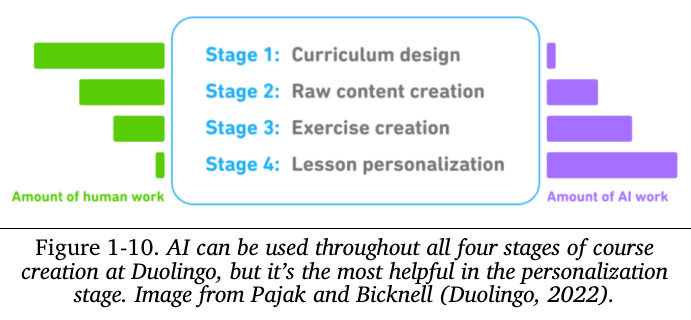

AI có thể tạo ra các bài kiểm tra, bao gồm cả dạng trắc nghiệm và dạng câu hỏi mở, và sau đó đánh giá các câu trả lời. AI có thể trở thành một người bạn tranh luận, vì nó giỏi hơn người bình thường rất nhiều trong việc trình bày các quan điểm khác nhau về cùng một chủ đề. Ví dụ, Khan Academy cung cấp các trợ giảng AI cho học sinh và các trợ lý khóa học cho giáo viên. Một phương pháp giảng dạy sáng tạo mà tôi từng thấy là giáo viên giao cho học sinh các bài luận do AI tạo ra để các em tìm và sửa lỗi.

Tuy nhiên, mặc dù nhiều công ty giáo dục đang tích cực áp dụng AI để tạo ra các sản phẩm tốt hơn, nhiều công ty khác lại nhận thấy mình đang bị AI lấy mất thị phần. Ví dụ, Chegg, một công ty chuyên giúp học sinh làm bài tập về nhà, đã chứng kiến giá cổ phiếu của mình sụt giảm thảm hại từ 28 đô la khi ChatGPT ra mắt vào tháng 11 năm 2022 xuống còn 2 đô la vào tháng 9 năm 2024, vì học sinh đã chuyển sang nhờ AI giúp đỡ.

Nếu rủi ro là AI có thể thay thế nhiều kỹ năng, thì cơ hội là AI có thể được sử dụng như một gia sư để học bất kỳ kỹ năng nào. Đối với nhiều kỹ năng, AI có thể giúp một người nhanh chóng nắm bắt những kiến thức cơ bản, và sau đó họ có thể tự mình tiếp tục học hỏi để trở nên giỏi hơn cả AI.

### 2.5 Các Bot trò chuyện

Các bot trò chuyện rất đa năng. Chúng có thể giúp chúng ta tìm kiếm thông tin, giải thích các khái niệm, và cùng chúng ta khởi tạo ý tưởng. AI có thể là bạn đồng hành và cũng có thể là nhà trị liệu của bạn. Nó có thể mô phỏng tính cách, cho phép bạn nói chuyện với một bản sao kỹ thuật số của bất kỳ ai bạn thích. Bạn gái và bạn trai kỹ thuật số đã trở nên nổi tiếng một cách kỳ lạ chỉ trong một khoảng thời gian cực kỳ ngắn. Nhiều người thậm chí đã dành nhiều thời gian nói chuyện với bot hơn là với con người (xem các cuộc thảo luận tại đây và tại đây). Một số người còn lo ngại rằng AI sẽ hủy hoại việc hẹn hò.

Trong lĩnh vực nghiên cứu, người ta cũng đã phát hiện ra rằng họ có thể sử dụng một nhóm các bot trò chuyện để mô phỏng một xã hội, cho phép họ thực hiện các nghiên cứu về động lực xã hội (Park và cộng sự, 2023).

Đối với các doanh nghiệp, loại bot phổ biến nhất là **bot hỗ trợ khách hàng**. Chúng có thể giúp các công ty tiết kiệm chi phí đồng thời cải thiện trải nghiệm của khách hàng, bởi vì chúng có thể phản hồi người dùng nhanh hơn so với các nhân viên con người. AI cũng có thể đóng vai trò là các **trợ lý ảo sản phẩm (product copilots)**, hướng dẫn khách hàng thực hiện những công việc phiền phức và khó hiểu như khai báo bảo hiểm, kê khai thuế, hay tra cứu các chính sách của công ty.

Sự thành công của ChatGPT đã thúc đẩy một làn sóng các bot trò chuyện dựa trên văn bản. Tuy nhiên, văn bản không phải là giao diện duy nhất cho các trợ lý ảo này. Các trợ lý giọng nói như Google Assistant, Siri, và Alexa đã xuất hiện từ nhiều năm nay.¹⁵ Các bot trò chuyện 3D cũng đã phổ biến trong các trò chơi và đang dần thu hút được sự chú ý trong ngành bán lẻ và tiếp thị.

Một trường hợp sử dụng của các nhân vật 3D được hỗ trợ bởi AI là các **NPC thông minh**, tức là các nhân vật không do người chơi điều khiển (non-player characters) (xem các bản demo của NVIDIA về Inworld và Convai).¹⁶ Các NPC là nhân vật thiết yếu để thúc đẩy cốt truyện của nhiều trò chơi. Nếu không có AI, các NPC thường chỉ được lập trình sẵn để thực hiện các hành động đơn giản với một vài câu thoại hạn chế. AI có thể khiến các NPC này trở nên thông minh hơn nhiều. Các bot thông minh có thể thay đổi cục diện của các trò chơi hiện có như The Sims và Skyrim, cũng như mở ra những thể loại game mới chưa từng có trước đây.

### 2.6 Tổng hợp Thông tin

Nhiều người tin rằng thành công của chúng ta phụ thuộc vào khả năng lọc và xử lý những thông tin hữu ích. Tuy nhiên, việc phải cập nhật liên tục email, tin nhắn Slack, và tin tức đôi khi có thể khiến chúng ta bị quá tải. May mắn thay, AI đã đến để giải cứu. AI đã chứng tỏ được khả năng tổng hợp và tóm tắt thông tin một cách hiệu quả. Theo một Nghiên cứu Nhanh về AI Tạo sinh của Salesforce vào năm 2023, 74% người dùng AI tạo sinh sử dụng nó để chắt lọc các ý tưởng phức tạp và tóm tắt thông tin.

Đối với người dùng cá nhân, nhiều ứng dụng có thể xử lý các tài liệu của bạn—như hợp đồng, các bản công bố thông tin, các bài báo—và cho phép bạn truy xuất thông tin theo kiểu trò chuyện. Trường hợp sử dụng này còn được gọi là "trò chuyện với tài liệu của bạn" (talk-to-your-docs). AI có thể giúp bạn tóm tắt các trang web, các bài nghiên cứu, và tạo báo cáo về các chủ đề mà bạn lựa chọn. Trong quá trình viết cuốn sách này, tôi đã nhận thấy AI rất hữu ích trong việc tóm tắt và so sánh các bài báo khoa học.

Việc tổng hợp và chắt lọc thông tin là rất cần thiết cho hoạt động của doanh nghiệp. Việc tổng hợp và phổ biến thông tin hiệu quả hơn có thể giúp một tổ chức trở nên tinh gọn hơn, vì nó làm giảm bớt gánh nặng cho cấp quản lý trung gian. Khi công ty Instacart ra mắt một "sàn giao dịch câu lệnh" nội bộ, họ đã phát hiện ra rằng một trong những mẫu câu lệnh phổ biến nhất là "Phân tích nhanh" (Fast Breakdown). Mẫu này yêu cầu AI tóm tắt các ghi chú cuộc họp, email, và các cuộc trò chuyện trên Slack thành ba phần: các sự thật, các câu hỏi mở, và các mục cần hành động. Các mục cần hành động này sau đó có thể được tự động chèn vào một công cụ theo dõi dự án và được giao cho những người phụ trách phù hợp.

AI cũng có thể giúp bạn làm nổi bật những thông tin quan trọng về các khách hàng tiềm năng và thực hiện các phân tích về đối thủ cạnh tranh của bạn.

Bạn càng thu thập nhiều thông tin, việc tổ chức nó lại càng trở nên quan trọng. Việc tổng hợp thông tin luôn đi đôi với việc tổ chức dữ liệu.

### 2.7 Tổ chức Dữ liệu

Một điều chắc chắn về tương lai là chúng ta sẽ tiếp tục tạo ra ngày càng nhiều dữ liệu. Người dùng điện thoại thông minh sẽ tiếp tục chụp ảnh và quay video. Các công ty sẽ tiếp tục ghi lại (log) mọi thứ về sản phẩm, nhân viên và khách hàng của họ. Hàng tỷ hợp đồng được tạo ra mỗi năm. Ảnh, video, các tệp ghi nhật ký, và các tệp PDF đều là **dữ liệu phi cấu trúc hoặc bán cấu trúc**. Việc tổ chức tất cả dữ liệu này theo một cách có thể tìm kiếm được sau này là cực kỳ cần thiết.

Và AI có thể giúp giải quyết chính xác vấn đề đó. AI có thể tự động tạo ra các mô tả bằng văn bản về hình ảnh và video, hoặc giúp đối chiếu các truy vấn tìm kiếm bằng văn bản với những hình ảnh phù hợp với các truy vấn đó. Các dịch vụ như Google Photos đã và đang sử dụng AI để tìm và hiển thị những hình ảnh khớp với các truy vấn tìm kiếm.¹⁷ Google Image Search còn tiến một bước xa hơn: nếu không có hình ảnh nào có sẵn phù hợp với nhu-cầu của người dùng, nó có thể tự tạo ra một vài hình ảnh mới.

AI cũng rất giỏi trong việc phân tích dữ liệu. Nó có thể viết các chương trình để tạo ra các biểu đồ trực quan hóa dữ liệu, xác định các điểm dữ liệu bất thường (outliers), và đưa ra các dự đoán như dự báo doanh thu.¹⁸

Các doanh nghiệp có thể sử dụng AI để trích xuất thông tin có cấu trúc từ dữ liệu phi cấu trúc, điều này có thể được dùng để tổ chức dữ liệu và giúp cho việc tìm kiếm trở nên dễ dàng hơn.

*   Các trường hợp sử dụng đơn giản bao gồm việc tự động trích xuất thông tin từ thẻ tín dụng, bằng lái xe, hóa đơn, vé, thông tin liên hệ từ chân email, v.v.
*   Các trường hợp sử dụng phức tạp hơn bao gồm việc trích xuất dữ liệu từ hợp đồng, báo cáo, biểu đồ, và nhiều loại tài liệu khác.

Người ta ước tính rằng ngành công nghiệp IDP, tức là **xử lý dữ liệu thông minh (intelligent data processing)**, sẽ đạt 12,81 tỷ đô la vào năm 2030, với mức tăng trưởng 32,9% mỗi năm.

### 2.8 Tự động hóa Quy trình làm việc (Workflow Automation)

Mục tiêu cuối cùng là AI nên tự động hóa nhiều công việc nhất có thể. Đối với người dùng cuối, tự động hóa có thể giúp họ xử lý các công việc nhàm chán hàng ngày như đặt nhà hàng, yêu cầu hoàn tiền, lên kế hoạch cho chuyến đi, và điền vào các biểu mẫu.

Đối với các doanh nghiệp, AI có thể tự động hóa các công việc lặp đi lặp lại như quản lý khách hàng tiềm năng, xuất hóa đơn, hoàn trả chi phí, quản lý các yêu cầu của khách hàng, nhập liệu, và vân vân. Một trường hợp sử dụng đặc biệt thú vị là dùng các mô hình AI để tổng hợp dữ liệu, và dữ liệu này sau đó có thể được dùng để cải thiện chính các mô hình đó. Bạn có thể sử dụng AI để tạo nhãn cho dữ liệu của mình, kết hợp với sự tham gia của con người để cải thiện các nhãn đó. Chúng ta sẽ thảo luận về việc tổng hợp dữ liệu trong Chương 8.

Để hoàn thành nhiều tác vụ, việc truy cập vào các công cụ bên ngoài là cần thiết. Để đặt một nhà hàng, một ứng dụng có thể sẽ cần quyền mở một công cụ tìm kiếm để tra cứu số điện thoại của nhà hàng, sử dụng điện thoại của bạn để gọi điện, và thêm các cuộc hẹn vào lịch của bạn. Những AI có khả năng lập kế hoạch và sử dụng các công cụ được gọi là **agents**.

Mức độ quan tâm dành cho các agents là rất lớn, gần như là một sự ám ảnh, nhưng điều đó không phải là hoàn toàn vô cớ. Các agent AI có tiềm năng giúp mỗi người trở nên năng suất hơn rất nhiều và tạo ra giá trị kinh tế lớn hơn rất nhiều. Agents là một chủ đề trọng tâm trong Chương 6.

Việc tìm hiểu về các ứng dụng AI khác nhau thực sự rất thú vị. Một trong những điều tôi thích mơ mộng nhất là về những ứng dụng khác nhau mà tôi có thể xây dựng. Tuy nhiên, không phải ứng dụng nào cũng nên được xây dựng. Phần tiếp theo sẽ thảo luận về những điều chúng ta nên cân nhắc trước khi xây dựng một ứng dụng AI.

## 3. Lập kế hoạch cho một Ứng dụng AI

Với tiềm năng dường như vô hạn của AI, thật khó để cưỡng lại mong muốn bắt tay ngay vào việc xây dựng các ứng dụng. Nếu bạn chỉ muốn học hỏi và trải nghiệm cho vui, hãy cứ bắt tay vào làm ngay. Tự mình xây dựng là một trong những cách học tốt nhất. Vào những ngày đầu của các mô hình nền tảng, một vài trưởng bộ phận AI đã nói với tôi rằng họ khuyến khích đội nhóm của mình thử nghiệm với các ứng dụng AI để tự nâng cao kỹ năng.

Tuy nhiên, nếu bạn làm việc này để kiếm sống, có lẽ bạn nên lùi lại một bước và cân nhắc xem **tại sao** bạn lại xây dựng ứng dụng này và **bạn nên thực hiện nó như thế nào**. Việc tạo ra một bản demo thú vị với các mô hình nền tảng thì rất dễ. Nhưng việc tạo ra một sản phẩm có thể sinh lời thì lại rất khó.

### 3.1. Đánh giá Trường hợp sử dụng

Câu hỏi đầu tiên cần đặt ra là tại sao bạn lại muốn xây dựng ứng dụng này. Giống như nhiều quyết định kinh doanh khác, việc xây dựng một ứng dụng AI thường là một sự phản ứng trước những **rủi ro** và **cơ hội**. Dưới đây là một vài ví dụ về các mức độ rủi ro khác nhau, được sắp xếp từ cao đến thấp:

1.  **Nếu bạn không làm, các đối thủ cạnh tranh có AI có thể khiến bạn trở nên lỗi thời.** Nếu AI đặt ra một mối đe dọa sống còn lớn đối với doanh nghiệp của bạn, việc tích hợp AI phải là ưu tiên hàng đầu. Trong nghiên cứu của Gartner năm 2023, 7% đã cho rằng "tính liên tục trong kinh doanh" là lý do họ áp dụng AI. Điều này phổ biến hơn đối với các doanh nghiệp liên quan đến xử lý tài liệu và tổng hợp thông tin, chẳng hạn như phân tích tài chính, bảo hiểm, và xử lý dữ liệu. Điều này cũng phổ biến đối với các công việc sáng tạo như quảng cáo, thiết kế web, và sản xuất hình ảnh. Bạn có thể tham khảo nghiên cứu của OpenAI năm 2023, “GPTs are GPTs” (Eloundou và cộng sự, 2023), để xem các ngành công nghiệp được xếp hạng như thế nào về mức độ bị ảnh hưởng bởi AI.

2.  **Nếu bạn không làm, bạn sẽ bỏ lỡ các cơ hội để tăng lợi nhuận và năng suất.** Hầu hết các công ty áp dụng AI là vì những cơ hội mà nó mang lại. AI có thể giúp ích trong hầu hết, nếu không muốn nói là tất cả, các hoạt động kinh doanh. AI có thể giúp việc thu hút người dùng trở nên rẻ hơn bằng cách tạo ra các bài viết quảng cáo, mô tả sản phẩm, và nội dung hình ảnh quảng cáo hiệu quả hơn. AI có thể tăng tỷ lệ giữ chân người dùng bằng cách cải thiện dịch vụ hỗ trợ khách hàng và cá nhân hóa trải nghiệm người dùng. AI cũng có thể giúp tạo ra khách hàng tiềm năng, cải thiện giao tiếp nội bộ, nghiên cứu thị trường, và theo dõi đối thủ cạnh tranh.

3.  **Bạn chưa chắc chắn AI sẽ phù hợp với doanh nghiệp của mình ở điểm nào, nhưng bạn không muốn bị bỏ lại phía sau.** Mặc dù một công ty không nên chạy theo mọi trào lưu, nhiều công ty đã thất bại vì chờ đợi quá lâu mới dám thực hiện bước nhảy vọt (hãy nhìn Kodak, Blockbuster, và BlackBerry). Việc đầu tư nguồn lực để tìm hiểu xem một công nghệ mới mang tính chuyển đổi có thể tác động đến doanh nghiệp của bạn như thế nào không phải là một ý tưởng tồi nếu bạn có đủ khả năng. Tại các công ty lớn hơn, việc này có thể là một phần của bộ phận Nghiên cứu và Phát triển (R&D).¹⁹

Một khi bạn đã tìm thấy một lý do chính đáng để phát triển trường hợp sử dụng này, bạn có thể cân nhắc xem liệu bạn có nhất thiết phải **tự mình xây dựng** nó hay không. Nếu AI đặt ra một mối đe dọa sống còn cho doanh nghiệp của bạn, có lẽ bạn sẽ muốn tự phát triển AI trong nội bộ thay vì thuê ngoài một đối thủ cạnh tranh để làm việc đó. Tuy nhiên, nếu bạn đang sử dụng AI để tăng lợi nhuận và năng suất, bạn có thể có rất nhiều **lựa chọn mua sẵn** có thể giúp bạn tiết kiệm thời gian và tiền bạc, đồng thời mang lại hiệu suất tốt hơn.

### 3.2 Vai trò của AI và con người trong ứng dụng

Vai trò của AI trong sản phẩm sẽ ảnh hưởng đến quá trình phát triển và các yêu cầu của ứng dụng đó. Apple có một tài liệu rất hay giải thích về các cách khác nhau mà AI có thể được sử dụng trong một sản phẩm. Dưới đây là ba điểm chính liên quan đến cuộc thảo luận của chúng ta:

*   **Then chốt hay Bổ trợ (Critical or complementary)**
    *   Nếu một ứng dụng vẫn có thể hoạt động mà không cần AI, thì vai trò của AI trong ứng dụng đó là **bổ trợ**. Ví dụ, Face ID sẽ không thể hoạt động nếu không có công nghệ nhận dạng khuôn mặt bằng AI, trong khi đó Gmail vẫn sẽ hoạt động được ngay cả khi không có tính năng Soạn thư thông minh (Smart Compose).
    *   Vai trò của AI càng **then chốt** đối với ứng dụng, thì phần AI đó càng phải chính xác và đáng tin cậy. Người dùng sẽ dễ chấp nhận sai sót hơn khi AI không phải là tính năng cốt lõi của ứng dụng.

*   **Phản ứng hay Chủ động (Reactive or proactive)**
    *   Một tính năng **phản ứng** (reactive) sẽ đưa ra phản hồi sau khi có yêu cầu hoặc hành động cụ thể từ người dùng, trong khi một tính năng **chủ động** (proactive) sẽ tự đưa ra phản hồi khi có cơ hội. Ví dụ, một chatbot là một tính năng phản ứng, trong khi các cảnh báo giao thông trên Google Maps là một tính năng chủ động.
    *   Bởi vì các tính năng phản ứng được tạo ra để đáp lại các sự kiện, chúng thường (nhưng không phải luôn luôn) cần phải diễn ra nhanh chóng. Ngược lại, các tính năng chủ động có thể được tính toán trước và hiển thị khi có cơ hội, vì vậy độ trễ (latency) không quá quan trọng.
    *   Bởi vì người dùng không yêu cầu các tính năng chủ động, họ có thể xem chúng là phiền phức hoặc khó chịu nếu chất lượng thấp. Do đó, các dự đoán và nội dung được tạo ra một cách chủ động thường có tiêu chuẩn chất lượng cao hơn.

*   **Động hay Tĩnh (Dynamic or static)**
    *   Các tính năng **động** (dynamic) được cập nhật liên tục dựa trên phản hồi của người dùng, trong khi các tính năng **tĩnh** (static) chỉ được cập nhật định kỳ. Ví dụ, Face ID cần được cập nhật khi khuôn mặt của người dùng thay đổi theo thời gian. Tuy nhiên, tính năng nhận dạng vật thể trong Google Photos có khả năng chỉ được cập nhật khi ứng dụng Google Photos được nâng cấp.
    *   Trong trường hợp của AI, các tính năng động có thể có nghĩa là mỗi người dùng sẽ có một mô hình của riêng mình, được tinh chỉnh liên tục dựa trên dữ liệu của họ, hoặc có các cơ chế cá nhân hóa khác như tính năng "bộ nhớ" của ChatGPT, cho phép ChatGPT ghi nhớ sở thích của từng người dùng. Ngược lại, các tính năng tĩnh có thể chỉ dùng một mô hình chung cho một nhóm người dùng. Nếu vậy, các tính năng này chỉ được cập nhật khi mô hình chung đó được cập nhật.

Việc làm rõ vai trò của con người trong ứng dụng cũng rất quan trọng. AI sẽ đóng vai trò hỗ trợ con người từ phía sau, trực tiếp đưa ra quyết định, hay cả hai? Ví dụ, đối với một chatbot hỗ trợ khách hàng, các câu trả lời của AI có thể được sử dụng theo nhiều cách khác nhau:

*   AI hiển thị một vài phương án trả lời để nhân viên con người tham khảo và viết phản hồi nhanh hơn.
*   AI chỉ trả lời các yêu cầu đơn giản và chuyển các yêu cầu phức tạp hơn cho con người.
*   AI trả lời tất cả các yêu cầu một cách trực tiếp mà không cần sự can thiệp của con người.

Việc đưa con người vào quy trình ra quyết định của AI được gọi là **"con người trong vòng lặp" (human-in-the-loop)**.

Microsoft (2023) đã đề xuất một khuôn khổ để tăng dần mức độ tự động hóa của AI trong các sản phẩm mà họ gọi là **Bò-Đi-Chạy (Crawl-Walk-Run)**:

1.  **Bò (Crawl):** Sự tham gia của con người là bắt buộc.
2.  **Đi (Walk):** AI có thể tương tác trực tiếp với các nhân viên nội bộ.
3.  **Chạy (Run):** Mức độ tự động hóa được tăng lên, có thể bao gồm cả việc AI tương tác trực tiếp với người dùng bên ngoài.

Vai trò của con người có thể thay đổi theo thời gian khi chất lượng của hệ thống AI được cải thiện. Ví dụ, lúc ban đầu, khi bạn vẫn đang đánh giá khả năng của AI, bạn có thể chỉ dùng nó để tạo ra các gợi ý cho nhân viên con người. Nếu tỷ lệ chấp nhận của nhân viên con người là cao, ví dụ, 95% các câu trả lời do AI đề xuất cho các yêu cầu đơn giản được nhân viên sử dụng nguyên văn, thì bạn có thể cho phép khách hàng tương tác trực tiếp với AI đối với những yêu cầu đơn giản đó.

### 3.3 Khả năng phòng thủ cho sản phẩm AI

Nếu bạn đang bán các ứng dụng AI như những sản phẩm độc lập, việc xem xét đến **khả năng phòng thủ (defensibility)** của chúng là rất quan trọng. Rào cản gia nhập thấp vừa là một ưu điểm, vừa là một nhược điểm. Nếu một thứ gì đó dễ dàng cho bạn xây dựng, thì nó cũng dễ dàng cho các đối thủ cạnh tranh của bạn. Vậy bạn có những "con hào" nào để bảo vệ sản phẩm của mình?

Nói một cách nào đó, việc xây dựng ứng dụng dựa trên các mô hình nền tảng cũng có nghĩa là bạn đang cung cấp một "lớp" (layer) nằm bên trên các mô hình này.²⁰ Điều này cũng có nghĩa là nếu các mô hình nền tảng bên dưới được mở rộng về khả năng, cái "lớp" mà bạn cung cấp có thể sẽ bị chính các mô hình đó nuốt chửng, khiến ứng dụng của bạn trở nên lỗi thời. Hãy tưởng tượng bạn xây dựng một ứng dụng phân tích tệp PDF dựa trên ChatGPT với giả định rằng ChatGPT không thể phân tích tệp PDF tốt hoặc không thể làm điều đó ở quy mô lớn. Khả năng cạnh tranh của bạn sẽ yếu đi nếu giả định này không còn đúng nữa. Tuy nhiên, ngay cả trong trường hợp này, một ứng dụng phân tích PDF vẫn có thể có ý nghĩa nếu nó được xây dựng trên các mô hình mã nguồn mở, hướng giải pháp của bạn đến những người dùng muốn tự lưu trữ và vận hành mô hình (in-house).

Một đối tác điều hành tại một quỹ đầu tư mạo hiểm lớn đã nói với tôi rằng bà đã thấy nhiều công ty khởi nghiệp mà toàn bộ sản phẩm của họ có thể chỉ là một tính năng của Google Docs hay Microsoft Office. Nếu sản phẩm của họ thành công, điều gì sẽ ngăn cản Google hay Microsoft giao cho ba kỹ sư sao chép lại các sản phẩm này chỉ trong hai tuần?

Trong lĩnh vực AI, thường có ba loại lợi thế cạnh tranh chính: **công nghệ, dữ liệu, và kênh phân phối**—tức là khả năng đưa sản phẩm của bạn đến tay người dùng.

*   Với các mô hình nền tảng, công nghệ cốt lõi của hầu hết các công ty sẽ tương tự nhau.
*   Lợi thế về kênh phân phối có khả năng thuộc về các công ty lớn.
*   Lợi thế về dữ liệu thì phức tạp hơn một chút. Các công ty lớn có thể có nhiều dữ liệu sẵn có hơn. Tuy nhiên, nếu một công ty khởi nghiệp có thể đi trước ra thị trường và thu thập đủ dữ liệu sử dụng để liên tục cải thiện sản phẩm của mình, thì dữ liệu sẽ là "con hào" của họ. Ngay cả trong các trường hợp không thể sử dụng trực tiếp dữ liệu người dùng để huấn luyện mô hình, thông tin về cách sử dụng sản phẩm vẫn có thể mang lại những hiểu biết vô giá về hành vi người dùng và những thiếu sót của sản phẩm, từ đó có thể định hướng cho quá trình thu thập dữ liệu và huấn luyện.²¹

Đã có rất nhiều công ty thành công dù sản phẩm ban đầu của họ lẽ ra đã có thể chỉ là một tính năng của các sản phẩm lớn hơn. Calendly lẽ ra đã có thể là một tính năng của Google Calendar. Mailchimp lẽ ra đã có thể là một tính năng của Gmail. Photoroom lẽ ra đã có thể là một tính năng của Google Photos.²² Nhiều công ty khởi nghiệp cuối cùng đã vượt qua các đối thủ lớn hơn, bằng cách bắt đầu từ việc xây dựng một tính năng mà các đối thủ lớn này đã bỏ qua. Biết đâu sản phẩm của bạn sẽ là cái tên tiếp theo.

### 3.4 Thiết lập Kỳ vọng

Một khi bạn đã quyết định rằng mình cần phải tự xây dựng ứng dụng AI tuyệt vời này, bước tiếp theo là phải xác định xem **thành công trông như thế nào**: bạn sẽ đo lường sự thành công đó ra sao? Chỉ số quan trọng nhất chính là mức độ tác động của ứng dụng này đối với việc kinh doanh của bạn. Ví dụ, nếu đó là một chatbot hỗ trợ khách hàng, các chỉ số kinh doanh có thể bao gồm:

*   Bạn muốn chatbot tự động hóa bao nhiêu phần trăm tin nhắn của khách hàng?
*   Chatbot sẽ giúp bạn xử lý thêm được bao nhiêu tin nhắn?
*   Tốc độ phản hồi của bạn sẽ nhanh hơn bao nhiêu khi sử dụng chatbot?
*   Chatbot có thể giúp bạn tiết kiệm được bao nhiêu công sức của nhân viên?

Một chatbot có thể trả lời nhiều tin nhắn hơn, nhưng điều đó không có nghĩa là nó sẽ làm người dùng hài lòng. Vì vậy, việc theo dõi sự hài lòng của khách hàng và các phản hồi nói chung là rất quan trọng. Phần "Phản hồi từ Người dùng" sẽ thảo luận về cách thiết kế một hệ thống thu thập phản hồi.

Để đảm bảo một sản phẩm không được đưa đến tay khách hàng trước khi nó thực sự sẵn sàng, bạn cần phải có những kỳ vọng rõ ràng về **ngưỡng hữu dụng (usefulness threshold)** của nó: tức là nó phải tốt đến mức nào thì mới được xem là hữu ích. Ngưỡng hữu dụng có thể bao gồm các nhóm chỉ số sau:

*   **Các chỉ số chất lượng** để đo lường chất lượng các câu trả lời của chatbot.
*   **Các chỉ số về độ trễ**, bao gồm **TTFT** (thời gian đến token đầu tiên - time to first token), **TPOT** (thời gian cho mỗi token đầu ra - time per output token), và tổng độ trễ. Độ trễ ở mức nào là chấp nhận được sẽ phụ thuộc vào trường hợp sử dụng của bạn. Nếu tất cả các yêu cầu của khách hàng hiện tại đều đang được con người xử lý với thời gian phản hồi trung vị là một giờ, thì bất cứ tốc độ nào nhanh hơn mức này cũng có thể được coi là đủ tốt.
*   **Các chỉ số về chi phí**: chi phí cho mỗi yêu cầu suy luận (inference request) là bao nhiêu.
*   **Các chỉ số khác** như khả năng diễn giải (interpretability) và tính công bằng (fairness).

Nếu bạn vẫn chưa chắc chắn mình muốn sử dụng những chỉ số nào, đừng lo lắng. Phần còn lại của cuốn sách sẽ đề cập đến nhiều chỉ số trong số này.

### 3.5 Lập kế hoạch theo Giai đoạn

Một khi bạn đã đặt ra các mục tiêu có thể đo lường được, bạn cần một kế hoạch để đạt được những mục tiêu đó. Làm thế nào để đạt được mục tiêu sẽ phụ thuộc vào điểm xuất phát của bạn. Hãy đánh giá các mô hình hiện có để hiểu khả năng của chúng. Các mô hình có sẵn càng mạnh mẽ, bạn càng ít phải tốn công sức. Ví dụ, nếu mục tiêu của bạn là tự động hóa 60% các yêu cầu hỗ trợ khách hàng và mô hình có sẵn mà bạn muốn sử dụng đã có thể tự động hóa được 30% các yêu cầu, thì công sức bạn cần bỏ ra có thể sẽ ít hơn so với trường hợp nó chưa tự động hóa được yêu cầu nào cả.

Rất có thể các mục tiêu của bạn sẽ thay đổi sau khi đánh giá. Ví dụ, sau khi đánh giá, bạn có thể nhận ra rằng nguồn lực cần thiết để đưa ứng dụng đến **ngưỡng hữu dụng** sẽ nhiều hơn lợi nhuận tiềm năng mà nó mang lại, và do đó, bạn không còn muốn theo đuổi nó nữa.

Việc lập kế hoạch cho một sản phẩm AI cần phải tính đến **thách thức ở chặng cuối (last mile challenge)** của nó. Thành công ban đầu với các mô hình nền tảng có thể gây hiểu lầm. Vì khả năng cơ bản của các mô hình nền tảng vốn đã khá ấn tượng, nên việc xây dựng một bản demo thú vị có thể không tốn nhiều thời gian. Tuy nhiên, một bản demo ban đầu tốt không đảm bảo sẽ có một sản phẩm cuối cùng tốt. Bạn có thể chỉ mất một cuối tuần để xây dựng một bản demo, nhưng phải mất hàng tháng, thậm chí hàng năm, để xây dựng một sản phẩm hoàn chỉnh.

Trong bài báo UltraChat, Ding và cộng sự (2023) đã chia sẻ rằng “hành trình đi từ 0 đến 60 thì dễ dàng, trong khi việc tiến từ 60 đến 100 lại trở nên cực kỳ thách thức.” LinkedIn (2024) cũng chia sẻ một cảm nhận tương tự. Họ chỉ mất một tháng để đạt được 80% trải nghiệm mà họ mong muốn. Thành công ban đầu này đã khiến họ đánh giá thấp một cách nghiêm trọng khoảng thời gian cần thiết để cải thiện sản phẩm. Họ nhận thấy mình đã mất thêm bốn tháng nữa để cuối cùng vượt qua được mốc 95%. Rất nhiều thời gian đã được dành để khắc phục những trục trặc nhỏ của sản phẩm và đối phó với hiện tượng "ảo giác" (hallucinations). Tốc độ chậm chạp để đạt được từng 1% cải thiện tiếp theo thật sự rất nản lòng.

### 3.6 Bảo trì

Việc lập kế hoạch cho sản phẩm không dừng lại ở việc đạt được các mục tiêu của nó. Bạn cần phải suy nghĩ về việc sản phẩm này có thể sẽ thay đổi như thế nào theo thời gian và nó nên được bảo trì ra sao.

Việc bảo trì một sản phẩm AI còn có thêm một thách thức nữa, đó là tốc độ thay đổi chóng mặt của chính lĩnh vực AI. Lĩnh vực AI đã và đang phát triển cực kỳ nhanh chóng trong thập kỷ qua. Và nó có thể sẽ tiếp tục phát triển nhanh trong thập kỷ tới. Xây dựng dựa trên các mô hình nền tảng ngày nay có nghĩa là bạn phải chấp nhận leo lên chuyến tàu cao tốc này.

Nhiều thay đổi là những thay đổi tốt. Ví dụ, những hạn chế của nhiều mô hình đang được khắc phục. Độ dài ngữ cảnh (context length) ngày càng dài hơn. Kết quả đầu ra của mô hình ngày càng tốt hơn. Quá trình suy luận của mô hình (model inference), tức là quá trình tính toán để tạo ra kết quả từ một đầu vào, đang trở nên nhanh hơn và rẻ hơn. Hình 1-11 cho thấy sự phát triển của chi phí suy luận và hiệu suất mô hình trên MMLU (Hendrycks và cộng sự, 2020), một bộ kiểm chuẩn phổ biến cho các mô hình nền tảng, trong giai đoạn từ năm 2022 đến 2024.

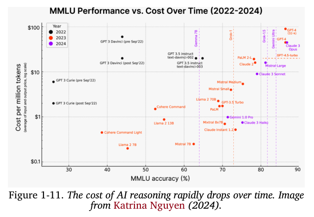

Tuy nhiên, ngay cả những thay đổi tốt đẹp này cũng có thể gây ra những xáo trộn trong quy trình làm việc của bạn. Bạn sẽ phải liên tục cảnh giác và thực hiện các phân tích chi phí-lợi ích cho mỗi khoản đầu tư công nghệ. Lựa chọn tốt nhất của ngày hôm nay có thể trở thành lựa chọn tồi tệ nhất vào ngày mai. Bạn có thể quyết định tự xây dựng một mô hình nội bộ vì có vẻ như nó rẻ hơn việc trả tiền cho các nhà cung cấp mô hình, nhưng rồi chỉ ba tháng sau lại phát hiện ra rằng các nhà cung cấp đã giảm giá xuống một nửa, khiến cho việc tự xây dựng lại trở thành một lựa chọn đắt đỏ. Bạn có thể đầu tư vào một giải pháp của bên thứ ba và xây dựng cơ sở hạ tầng của mình xoay quanh nó, để rồi nhà cung cấp đó lại phá sản vì không huy động được vốn.

Một số thay đổi thì dễ thích ứng hơn. Ví dụ, khi các nhà cung cấp mô hình đang dần hội tụ về cùng một chuẩn API, việc hoán đổi API của mô hình này sang mô hình khác đang trở nên dễ dàng hơn. Tuy nhiên, vì mỗi mô hình đều có những đặc tính, điểm mạnh và điểm yếu riêng, các nhà phát triển làm việc với mô hình mới sẽ cần phải điều chỉnh lại quy trình làm việc, các câu lệnh, và dữ liệu của họ cho phù hợp với mô hình mới này. Nếu không có một cơ sở hạ tầng phù hợp cho việc quản lý phiên bản và đánh giá, quá trình này có thể gây ra rất nhiều phiền toái.

Một số thay đổi khác lại khó thích ứng hơn, đặc biệt là những thay đổi liên quan đến các quy định pháp lý. Các công nghệ xoay quanh AI được nhiều quốc gia xem là vấn đề an ninh quốc gia, có nghĩa là các nguồn lực cho AI, bao gồm tài nguyên tính toán (compute), nhân tài, và dữ liệu, đều bị quản lý rất chặt chẽ. Ví dụ, việc ban hành Quy định chung về bảo vệ dữ liệu (GDPR) của Châu Âu được ước tính đã khiến các doanh nghiệp tốn 9 tỷ đô la để tuân thủ. Khả năng tiếp cận tài nguyên tính toán có thể thay đổi chỉ sau một đêm khi các luật mới đặt ra nhiều hạn chế hơn về việc ai có thể mua và bán các tài nguyên này (xem Sắc lệnh Hành pháp tháng 10 năm 2023 của Hoa Kỳ). Nếu nhà cung cấp GPU của bạn đột nhiên bị cấm bán GPU cho quốc gia của bạn, bạn sẽ gặp rắc rối lớn.

Một số thay đổi thậm chí có thể mang tính "chí mạng". Ví dụ, các quy định về sở hữu trí tuệ (IP) và việc sử dụng AI vẫn đang trong quá trình hoàn thiện. Nếu bạn xây dựng sản phẩm của mình dựa trên một mô hình được huấn luyện bằng dữ liệu của người khác, liệu bạn có chắc chắn rằng IP của sản phẩm sẽ luôn thuộc về bạn không? Nhiều công ty phụ thuộc nhiều vào sở hữu trí tuệ mà tôi đã nói chuyện, chẳng hạn như các studio game, đều do dự trong việc sử dụng AI vì lo sợ sẽ mất IP của mình sau này.

Một khi bạn đã quyết tâm xây dựng một sản phẩm AI, chúng ta hãy cùng xem xét hệ thống công nghệ kỹ thuật cần thiết để xây dựng các ứng dụng này.

## 4. Hệ thống Công nghệ Kỹ thuật AI (The AI Engineering Stack)

Sự phát triển nhanh chóng của Kỹ thuật AI cũng kéo theo một làn sóng thổi phồng và hội chứng FOMO (nỗi sợ bị bỏ lỡ) cực kỳ lớn. Số lượng các công cụ, kỹ thuật, mô hình, và ứng dụng mới được giới thiệu mỗi ngày có thể gây choáng ngợp. Thay vì cố gắng chạy theo những xu hướng thay đổi không ngừng, chúng ta hãy cùng xem xét các thành phần nền tảng của Kỹ thuật AI.

Để hiểu về Kỹ thuật AI, điều quan trọng là phải nhận ra rằng lĩnh vực này được phát triển từ **Kỹ thuật Học máy (ML Engineering)**. Khi một công ty bắt đầu thử nghiệm với các mô hình nền tảng, việc đội ngũ Kỹ thuật Học máy hiện có của họ dẫn dắt công việc này là điều hoàn toàn tự nhiên. Một số công ty xem Kỹ thuật AI cũng giống như Kỹ thuật Học máy, như được trình bày trong Hình 1-12.

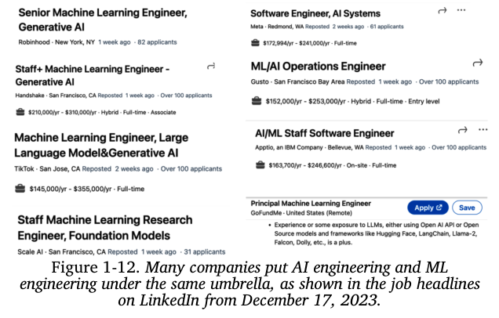

Một số công ty khác lại có các bản mô tả công việc riêng cho vị trí Kỹ sư AI, như được trình bày trong Hình 1-13.

Bất kể các tổ chức sắp xếp vị trí của Kỹ sư AI và Kỹ sư Học máy như thế nào, vai trò của họ vẫn có sự chồng chéo đáng kể. Các Kỹ sư Học máy hiện tại có thể bổ sung Kỹ thuật AI vào bộ kỹ năng của mình để mở rộng cơ hội việc làm. Tuy nhiên, cũng có những Kỹ sư AI không hề có kinh nghiệm về Học máy trước đây.

Để hiểu rõ nhất về Kỹ thuật AI và sự khác biệt của nó so với Kỹ thuật Học máy truyền thống, phần tiếp theo sẽ phân tích các lớp khác nhau trong quy trình xây dựng ứng dụng AI, đồng thời xem xét vai trò của mỗi lớp trong cả Kỹ thuật AI và Kỹ thuật Học máy.

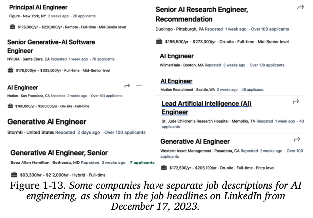

### 4.1 Ba Tầng của Hệ thống Công nghệ AI

Bất kỳ hệ thống công nghệ cho ứng dụng AI nào cũng bao gồm ba tầng: **phát triển ứng dụng, phát triển mô hình, và cơ sở hạ tầng**. Khi phát triển một ứng dụng AI, bạn thường sẽ bắt đầu từ tầng trên cùng và đi xuống các tầng dưới khi cần thiết:

1.  **Phát triển Ứng dụng**
    Với việc các mô hình đã có sẵn, bất kỳ ai cũng có thể sử dụng chúng để phát triển ứng dụng. Đây là tầng đã chứng kiến nhiều hoạt động nhất trong hai năm qua, và nó vẫn đang phát triển một cách nhanh chóng. Việc phát triển ứng dụng ở tầng này bao gồm việc cung cấp cho mô hình những câu lệnh (prompts) tốt và ngữ cảnh cần thiết. Tầng này đòi hỏi phải có sự đánh giá nghiêm ngặt. Các ứng dụng tốt cũng đòi hỏi phải có giao diện tốt.

2.  **Phát triển Mô hình**
    Tầng này cung cấp các công cụ để phát triển mô hình, bao gồm các framework (khung làm việc) cho việc lập mô hình, huấn luyện (training), tinh chỉnh (finetuning), và tối ưu hóa suy luận (inference optimization). Bởi vì dữ liệu là trung tâm của việc phát triển mô hình, tầng này cũng bao gồm cả việc xử lý và xây dựng bộ dữ liệu (dataset engineering). Việc phát triển mô hình cũng đòi hỏi phải có sự đánh giá nghiêm ngặt.

3.  **Cơ sở hạ tầng**
    Ở tầng dưới cùng của hệ thống là cơ sở hạ tầng. Tầng này bao gồm các công cụ để phục vụ mô hình (model serving), quản lý dữ liệu và tài nguyên tính toán (compute), và giám sát (monitoring).

Ba tầng này và các ví dụ về trách nhiệm công việc cho mỗi tầng được trình bày trong Hình 1-14.

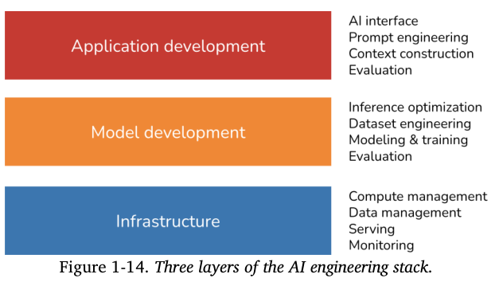

Để có được một cái nhìn tổng quan về sự thay đổi của toàn cảnh công nghệ kể từ khi có các mô hình nền tảng, vào tháng 3 năm 2024, tôi đã tìm kiếm trên GitHub tất cả các kho mã nguồn (repositories) liên quan đến AI có ít nhất 500 sao.

Với sự phổ biến của GitHub, tôi tin rằng dữ liệu này là một chỉ số đại diện tốt để chúng ta có thể hiểu về hệ sinh thái này. Trong phân tích của mình, tôi cũng bao gồm các kho mã nguồn dành cho các ứng dụng và các mô hình, vốn lần lượt là sản phẩm của tầng phát triển ứng dụng và tầng phát triển mô hình. Tôi đã tìm thấy tổng cộng 920 kho mã nguồn.

Hình 1-15 cho thấy số lượng cộng dồn của các kho mã nguồn trong mỗi danh mục theo từng tháng.

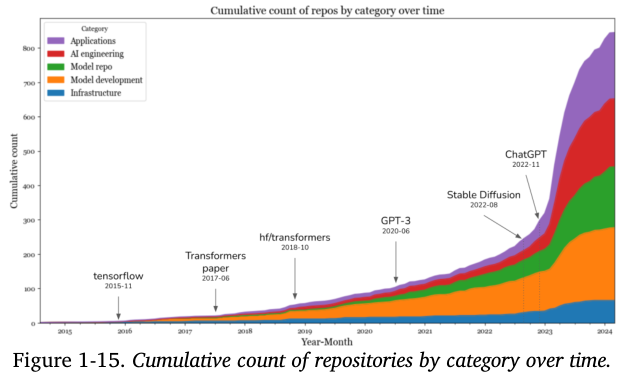

Dữ liệu cho thấy một bước nhảy vọt lớn về số lượng các công cụ AI trong năm 2023, sau sự ra đời của Stable Diffusion và ChatGPT. Trong năm 2023, các danh mục có mức tăng trưởng cao nhất là **ứng dụng** và **phát triển ứng dụng**. Tầng **cơ sở hạ tầng** cũng có sự tăng trưởng nhất định, nhưng ít hơn nhiều so với các tầng khác.

Điều này cũng dễ hiểu. Mặc dù các mô hình và ứng dụng đã thay đổi, nhưng các nhu cầu cốt lõi về cơ sở hạ tầng—như quản lý tài nguyên, phục vụ mô hình, giám sát, v.v.—vẫn không thay đổi.

Điều này dẫn chúng ta đến điểm tiếp theo. Mặc dù mức độ hào hứng và sáng tạo xung quanh các mô hình nền tảng là chưa từng có, nhiều nguyên tắc xây dựng ứng dụng AI vẫn không thay đổi. Đối với các trường hợp sử dụng trong doanh nghiệp, các ứng dụng AI vẫn cần phải giải quyết các vấn đề kinh doanh, và do đó, việc liên kết các chỉ số kinh doanh với các chỉ số học máy và ngược lại vẫn là điều cần thiết. Bạn vẫn cần phải thử nghiệm một cách có hệ thống.

*   Với Kỹ thuật Học máy cổ điển, bạn thử nghiệm với các siêu tham số (hyperparameters) khác nhau.
*   Với các mô hình nền tảng, bạn thử nghiệm với các mô hình, câu lệnh (prompts), thuật toán truy xuất (retrieval algorithms), các biến lấy mẫu (sampling variables) khác nhau, và nhiều hơn nữa. (Các biến lấy mẫu sẽ được thảo luận trong Chương 2.)

Chúng ta vẫn muốn làm cho các mô hình chạy nhanh hơn và rẻ hơn. Việc thiết lập một vòng lặp phản hồi để có thể liên tục cải tiến các ứng dụng của mình bằng dữ liệu vận hành thực tế vẫn rất quan trọng.

Điều này có nghĩa là phần lớn những gì các kỹ sư học máy đã học hỏi và chia sẻ trong thập kỷ qua vẫn còn có thể áp dụng được. Kinh nghiệm tập thể này giúp cho mọi người có thể bắt đầu xây dựng các ứng dụng AI một cách dễ dàng hơn.

Tuy nhiên, được xây dựng trên nền tảng của những nguyên tắc bền vững này là rất nhiều sự đổi mới độc đáo chỉ có ở Kỹ thuật AI, và đó cũng chính là những gì chúng ta sẽ khám phá trong cuốn sách này.

### 4.2 So sánh Kỹ thuật AI và Kỹ thuật Học máy

Mặc dù những nguyên tắc bất biến trong việc triển khai ứng dụng AI mang lại cảm giác yên tâm, việc hiểu rõ những gì đã thay đổi cũng rất quan trọng. Điều này sẽ hữu ích cho các đội nhóm muốn điều chỉnh nền tảng hiện có của mình cho các trường hợp sử dụng AI mới, và cho các nhà phát triển đang muốn biết cần học kỹ năng nào để duy trì tính cạnh tranh trong thị trường mới này.

Ở cấp độ tổng quan, việc xây dựng ứng dụng sử dụng các mô hình nền tảng ngày nay khác với Kỹ thuật Học máy truyền thống ở ba điểm chính:

1.  Nếu không có các mô hình nền tảng, bạn phải **tự huấn luyện mô hình** của riêng mình cho các ứng dụng. Với Kỹ thuật AI, bạn **sử dụng một mô hình mà người khác đã huấn luyện sẵn** cho bạn. Điều này có nghĩa là Kỹ thuật AI tập trung ít hơn vào việc lập mô hình và huấn luyện, và nhiều hơn vào việc **điều chỉnh mô hình (model adaptation)**.

2.  Kỹ thuật AI làm việc với các mô hình **lớn hơn, tiêu tốn nhiều tài nguyên tính toán hơn, và có độ trễ cao hơn** so với Kỹ thuật Học máy truyền thống. Điều này có nghĩa là có nhiều áp lực hơn trong việc tối ưu hóa huấn luyện và suy luận một cách hiệu quả. Hệ quả của các mô hình đòi hỏi nhiều tài nguyên tính toán là nhiều công ty giờ đây cần nhiều GPU hơn và làm việc với các cụm máy tính (compute clusters) lớn hơn so với trước đây, điều này có nghĩa là nhu cầu về các kỹ sư biết cách làm việc với GPU và các cụm máy tính lớn cũng tăng lên.²³

3.  Kỹ thuật AI làm việc với các mô hình có thể tạo ra các **kết quả đầu ra có nội dung mở (open-ended outputs)**. Các kết quả đầu ra có nội dung mở mang lại cho mô hình sự linh hoạt để có thể được sử dụng cho nhiều tác vụ hơn, nhưng chúng cũng khó đánh giá hơn. Điều này khiến cho việc **đánh giá** trở thành một vấn đề lớn hơn nhiều trong Kỹ thuật AI.

Tóm lại, Kỹ thuật AI khác với Kỹ thuật Học máy ở chỗ nó ít tập trung vào việc **phát triển mô hình** mà tập trung nhiều hơn vào việc **điều chỉnh và đánh giá mô hình**. Tôi đã đề cập đến việc điều chỉnh mô hình nhiều lần trong chương này, vì vậy trước khi chúng ta tiếp tục, tôi muốn đảm bảo rằng chúng ta đều hiểu đúng về ý nghĩa của nó. Nhìn chung, các kỹ thuật điều chỉnh mô hình có thể được chia thành hai loại, tùy thuộc vào việc chúng có yêu cầu cập nhật các trọng số (weights) của mô hình hay không.

*   Các **kỹ thuật dựa trên câu lệnh (Prompt-based techniques)**, bao gồm **kỹ thuật câu lệnh (prompt engineering)**, điều chỉnh một mô hình mà không cần cập nhật các trọng số của mô hình. Bạn điều chỉnh một mô hình bằng cách cung cấp cho nó các chỉ dẫn và ngữ cảnh, thay vì thay đổi chính bản thân mô hình. Kỹ thuật câu lệnh dễ bắt đầu hơn và đòi hỏi ít dữ liệu hơn. Nhiều ứng dụng thành công đã được xây dựng chỉ với kỹ thuật câu lệnh. Sự dễ sử dụng của nó cho phép bạn thử nghiệm với nhiều mô hình hơn, giúp tăng cơ hội tìm thấy một mô hình tốt một cách bất ngờ cho ứng dụng của bạn. Tuy nhiên, kỹ thuật câu lệnh có thể không đủ cho các tác vụ phức tạp hoặc các ứng dụng có yêu cầu nghiêm ngặt về hiệu suất.

*   **Tinh chỉnh (Finetuning)**, ngược lại, đòi hỏi phải cập nhật các trọng số của mô hình. Bạn điều chỉnh một mô hình bằng cách thực hiện các thay đổi trên chính bản thân mô hình. Nhìn chung, các kỹ thuật tinh chỉnh phức tạp hơn và đòi hỏi nhiều dữ liệu hơn, nhưng chúng có thể cải thiện đáng kể về chất lượng, độ trễ, và chi phí của mô hình. Nhiều thứ không thể thực hiện được nếu không thay đổi các trọng số của mô hình, chẳng hạn như điều chỉnh mô hình cho một tác vụ mới mà nó chưa từng được tiếp xúc trong quá trình huấn luyện.

Bây giờ, hãy cùng đi sâu vào tầng phát triển ứng dụng và tầng phát triển mô hình để xem mỗi tầng đã thay đổi như thế nào với Kỹ thuật AI, bắt đầu với những gì mà các kỹ sư học máy hiện tại đã quen thuộc hơn. Phần này sẽ cung cấp một cái nhìn tổng quan về các quy trình khác nhau liên quan đến việc phát triển một ứng dụng AI. Cách thức hoạt động của các quy trình này sẽ được thảo luận xuyên suốt cuốn sách.

#### Phát triển Mô hình

Phát triển mô hình là tầng thường được liên kết nhiều nhất với Kỹ thuật Học máy truyền thống. Nó có ba trách nhiệm chính: lập mô hình và huấn luyện, kỹ thuật bộ dữ liệu, và tối ưu hóa suy luận. Việc đánh giá cũng là một yêu cầu, nhưng vì hầu hết mọi người sẽ bắt gặp nó đầu tiên ở tầng phát triển ứng dụng, tôi sẽ thảo luận về việc đánh giá trong phần tiếp theo.

##### Lập mô hình và Huấn luyện

Lập mô hình và huấn luyện là quá trình nghĩ ra một kiến trúc mô hình, huấn luyện nó, và tinh chỉnh nó. Ví dụ về các công cụ trong danh mục này là TensorFlow của Google, Transformers của Hugging Face, và PyTorch của Meta.

Việc phát triển các mô hình học máy đòi hỏi kiến thức chuyên sâu về Học máy. Nó đòi hỏi phải biết các loại thuật toán học máy khác nhau (như phân cụm, hồi quy logistic, cây quyết định, và lọc cộng tác) và các kiến trúc mạng nơ-ron (như feedforward, recurrent (hồi quy), convolutional (tích chập), và transformer). Nó cũng đòi hỏi phải hiểu cách một mô hình học, bao gồm các khái niệm như gradient descent, hàm mất mát (loss function), chính quy hóa (regularization), v.v.

Với sự sẵn có của các mô hình nền tảng, kiến thức về Học máy không còn là một yêu cầu bắt buộc để xây dựng các ứng dụng AI. Tôi đã gặp nhiều nhà xây dựng ứng dụng AI tuyệt vời và thành công mà không hề quan tâm đến việc tìm hiểu về gradient descent. Tuy nhiên, kiến thức về Học máy vẫn cực kỳ có giá trị, vì nó mở rộng bộ công cụ mà bạn có thể sử dụng và giúp khắc phục sự cố khi một mô hình không hoạt động như mong đợi.

> ### Về sự khác biệt giữa Huấn luyện, Tiền huấn luyện, Tinh chỉnh, và Hậu huấn luyện
>
> **Huấn luyện (Training)** luôn bao gồm việc thay đổi các trọng số của mô hình, nhưng không phải mọi sự thay đổi trọng số đều được coi là huấn luyện. Ví dụ, lượng tử hóa (quantization) - quá trình làm giảm độ chính xác của các trọng số mô hình - về mặt kỹ thuật là có thay đổi giá trị trọng số của mô hình, nhưng không được xem là huấn luyện.
>
> Thuật ngữ "huấn luyện" thường có thể được dùng để thay thế cho **tiền huấn luyện (pre-training)**, **tinh chỉnh (finetuning)**, và **hậu huấn luyện (post-training)**, vốn là các thuật ngữ chỉ các giai đoạn huấn luyện khác nhau:
>
> *   **Tiền huấn luyện**
>     Tiền huấn luyện là việc huấn luyện một mô hình **từ con số không**—khi các trọng số của mô hình được khởi tạo một cách ngẫu nhiên. Đối với các mô hình LLM, tiền huấn luyện thường bao gồm việc huấn luyện một mô hình để hoàn thiện văn bản. Trong tất cả các bước huấn luyện, tiền huấn luyện thường là bước **tốn nhiều tài nguyên nhất**, và tốn kém hơn rất nhiều so với các bước còn lại. Đối với mô hình InstructGPT, quá trình tiền huấn luyện chiếm tới 98% tổng tài nguyên tính toán và dữ liệu. Tiền huấn luyện cũng mất rất nhiều thời gian để thực hiện. Một sai sót nhỏ trong quá trình tiền huấn luyện có thể gây ra tổn thất tài chính đáng kể và làm dự án bị chậm lại rất nhiều. Do tính chất tốn kém tài nguyên, việc này đã trở thành một nghệ thuật mà chỉ một số ít người thực hành. Tuy nhiên, những người có chuyên môn về tiền huấn luyện các mô hình lớn lại rất được săn đón.²⁴
>
> *   **Tinh chỉnh**
>     Tinh chỉnh có nghĩa là **tiếp tục huấn luyện một mô hình đã được huấn luyện trước đó**—các trọng số của mô hình được lấy từ quá trình huấn luyện trước đó. Bởi vì mô hình đã có sẵn một số kiến thức nhất định từ quá trình tiền huấn luyện, việc tinh chỉnh thường đòi hỏi ít tài nguyên hơn (ví dụ: dữ liệu và tài nguyên tính toán) so với tiền huấn luyện.
>
> *   **Hậu huấn luyện**
>     Nhiều người dùng thuật ngữ hậu huấn luyện để chỉ quá trình huấn luyện một mô hình sau giai đoạn tiền huấn luyện. Về mặt khái niệm, **hậu huấn luyện và tinh chỉnh là giống nhau** và có thể được sử dụng thay thế cho nhau. Tuy nhiên, đôi khi, người ta có thể sử dụng chúng theo cách khác nhau để biểu thị các mục tiêu khác nhau.
>     *   Thường được gọi là **hậu huấn luyện** khi nó được thực hiện bởi các **nhà phát triển mô hình**. Ví dụ, OpenAI có thể hậu huấn luyện một mô hình để giúp nó tuân theo chỉ dẫn tốt hơn trước khi phát hành.
>     *   Thường được gọi là **tinh chỉnh** khi nó được thực hiện bởi các **nhà phát triển ứng dụng**. Ví dụ, bạn có thể tinh chỉnh một mô hình của OpenAI (vốn có thể đã được hậu huấn luyện) để điều chỉnh nó cho phù hợp với nhu cầu của mình.
>
> Tiền huấn luyện và hậu huấn luyện tạo thành một chuỗi liên tục.²⁵ Các quy trình và công cụ của chúng rất giống nhau. Sự khác biệt của chúng sẽ được khám phá thêm trong Chương 2 và Chương 7.
>
> Một số người dùng thuật ngữ "huấn luyện" để chỉ **kỹ thuật câu lệnh (prompt engineering)**, điều này là **không chính xác**. Tôi đã đọc một bài báo trên Business Insider, trong đó tác giả nói rằng cô ấy đã "huấn luyện" ChatGPT để bắt chước con người cô ấy lúc nhỏ. Cô ấy làm điều đó bằng cách đưa các trang nhật ký thời thơ ấu của mình vào ChatGPT. Một cách thông thường, việc sử dụng từ "huấn luyện" của tác giả là đúng, vì cô ấy đang dạy cho mô hình làm một việc gì đó. Nhưng về mặt kỹ thuật, nếu bạn dạy một mô hình phải làm gì thông qua ngữ cảnh đầu vào của mô hình, thì đó là bạn đang thực hiện **kỹ thuật câu lệnh**. Tương tự, tôi đã thấy nhiều người sử dụng thuật ngữ "tinh chỉnh" trong khi những gì họ làm thực chất là kỹ thuật câu lệnh.
> 

##### Kỹ thuật Bộ dữ liệu

Kỹ thuật bộ dữ liệu là quá trình giám tuyển, tạo ra, và gán nhãn cho dữ liệu cần thiết để huấn luyện và điều chỉnh các mô hình AI.

Trong Kỹ thuật Học máy truyền thống, hầu hết các trường hợp sử dụng đều có tính "đóng" (close-ended)—kết quả đầu ra của mô hình chỉ có thể nằm trong số các giá trị được định nghĩa trước. Ví dụ, việc phân loại thư rác chỉ với hai kết quả có thể có là "thư rác" và "không phải thư rác" là một tác vụ có tính đóng. Tuy nhiên, các mô hình nền tảng lại có tính "mở" (open-ended). Việc gán nhãn cho các truy vấn có tính mở khó hơn nhiều so với việc gán nhãn cho các truy vấn có tính đóng—việc xác định một email có phải là thư rác hay không dễ hơn nhiều so với việc viết một bài luận. Vì vậy, việc gán nhãn dữ liệu là một thách thức lớn hơn nhiều đối với Kỹ thuật AI.

Một điểm khác biệt nữa là Kỹ thuật Học máy truyền thống làm việc nhiều hơn với dữ liệu dạng bảng, trong khi các mô hình nền tảng lại làm việc với dữ liệu phi cấu trúc. Trong Kỹ thuật AI, việc xử lý dữ liệu tập trung nhiều hơn vào việc loại bỏ dữ liệu trùng lặp, token hóa, truy xuất ngữ cảnh, và kiểm soát chất lượng, bao gồm cả việc loại bỏ các thông tin nhạy cảm và dữ liệu độc hại. Kỹ thuật bộ dữ liệu là trọng tâm của Chương 8.

Nhiều người cho rằng bởi vì các mô hình giờ đây đã trở thành hàng hóa phổ thông, dữ liệu sẽ là yếu tố khác biệt chính, khiến cho kỹ thuật bộ dữ liệu trở nên quan trọng hơn bao giờ hết. Lượng dữ liệu bạn cần sẽ phụ thuộc vào kỹ thuật điều chỉnh mà bạn sử dụng. Huấn luyện một mô hình từ đầu thường đòi hỏi nhiều dữ liệu hơn so với việc tinh chỉnh, và việc tinh chỉnh lại đòi hỏi nhiều dữ liệu hơn so với kỹ thuật câu lệnh.

Bất kể bạn cần bao nhiêu dữ liệu, chuyên môn về dữ liệu vẫn rất hữu ích khi bạn xem xét một mô hình, vì dữ liệu huấn luyện của nó sẽ cung cấp những manh mối quan trọng về điểm mạnh và điểm yếu của mô hình đó.

##### Tối ưu hóa Suy luận

Tối ưu hóa suy luận có nghĩa là làm cho các mô hình chạy nhanh hơn và rẻ hơn. Việc tối ưu hóa suy luận luôn luôn quan trọng đối với Kỹ thuật Học máy. Người dùng không bao giờ từ chối các mô hình nhanh hơn, và các công ty luôn có thể hưởng lợi từ việc suy luận rẻ hơn. Tuy nhiên, khi các mô hình nền tảng được mở rộng quy mô và gây ra chi phí và độ trễ suy luận còn cao hơn nữa, việc tối ưu hóa suy luận đã trở nên quan trọng hơn bao giờ hết.

Một thách thức với các mô hình nền tảng là chúng thường có tính **tự hồi quy (autoregressive)**—tức là các token được tạo ra một cách tuần tự. Nếu một mô hình mất 10 ms để tạo ra một token, nó sẽ mất một giây để tạo ra một kết quả dài 100 token, và còn lâu hơn nữa cho các kết quả dài hơn. Khi người dùng ngày càng trở nên thiếu kiên nhẫn, việc giảm độ trễ của các ứng dụng AI xuống mức 100 ms như kỳ vọng đối với một ứng dụng internet thông thường là một thách thức rất lớn. Tối ưu hóa suy luận đã trở thành một phân ngành năng động trong cả giới công nghiệp và học thuật.

Bảng 1-4 dưới đây sẽ tóm tắt sự thay đổi về tầm quan trọng của các hạng mục khác nhau trong việc phát triển mô hình khi chuyển sang Kỹ thuật AI.

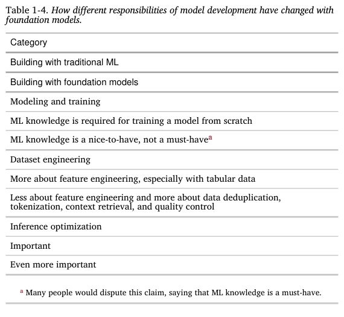

Các kỹ thuật tối ưu hóa suy luận, bao gồm **lượng tử hóa (quantization)**, **chưng cất (distillation)**, và **song song hóa (parallelism)**, sẽ được thảo luận trong các chương từ 7 đến 9.

#### Phát triển Ứng dụng

Với Kỹ thuật Học máy truyền thống, khi các đội nhóm xây dựng ứng dụng bằng các mô hình do chính họ tạo ra, chất lượng của mô hình chính là một yếu tố tạo nên sự khác biệt. Còn với các mô hình nền tảng, khi mà nhiều đội nhóm cùng sử dụng chung một mô hình, sự khác biệt phải đến từ chính quá trình phát triển ứng dụng.

Tầng phát triển ứng dụng bao gồm các trách nhiệm sau: **đánh giá, kỹ thuật câu lệnh, và giao diện AI.**

##### Đánh giá

Đánh giá là để giảm thiểu rủi ro và khám phá các cơ hội. Việc đánh giá là cần thiết trong suốt toàn bộ quá trình điều chỉnh mô hình. Việc đánh giá là cần thiết để lựa chọn mô hình, để đo lường tiến độ, để xác định xem một ứng dụng đã sẵn sàng để triển khai hay chưa, và để phát hiện các vấn đề cũng như cơ hội cải tiến trong quá trình vận hành thực tế.

Mặc dù việc đánh giá luôn luôn quan trọng trong Kỹ thuật Học máy, nó lại càng quan trọng hơn nữa đối với các mô hình nền tảng, vì nhiều lý do. Những thách thức của việc đánh giá các mô hình nền tảng sẽ được thảo luận trong Chương 3. Tóm lại, những thách thức này chủ yếu đến từ bản chất có **tính mở** và **khả năng được mở rộng** của các mô hình nền tảng.

Ví dụ, trong các tác vụ Học máy có **tính đóng** như phát hiện gian lận, thường sẽ có những **kết quả đúng được mong đợi (ground truths)** để bạn có thể so sánh kết quả đầu ra của mô hình với chúng. Nếu kết quả của mô hình khác với kết quả mong đợi, bạn biết ngay là mô hình đã sai. Tuy nhiên, đối với một tác vụ như chatbot, lại có vô số các câu trả lời khả dĩ cho mỗi câu lệnh, đến mức không thể nào tạo ra một danh sách đầy đủ tất cả các "kết quả đúng" để so sánh với câu trả lời của mô hình.

Sự tồn tại của quá nhiều kỹ thuật điều chỉnh khác nhau cũng khiến cho việc đánh giá trở nên khó khăn hơn. Một hệ thống hoạt động kém với kỹ thuật này có thể lại hoạt động tốt hơn nhiều với một kỹ thuật khác. Khi Google ra mắt Gemini vào tháng 12 năm 2023, họ đã tuyên bố rằng Gemini tốt hơn ChatGPT trong bộ kiểm chuẩn MMLU (Hendrycks và cộng sự, 2020). Google đã đánh giá Gemini bằng một kỹ thuật câu lệnh có tên là CoT@32. Với kỹ thuật này, Gemini được cho xem 32 ví dụ, trong khi ChatGPT chỉ được cho xem 5 ví dụ. Khi cả hai cùng được cho xem năm ví dụ, ChatGPT lại hoạt động tốt hơn, như được trình bày trong Bảng 1-5.

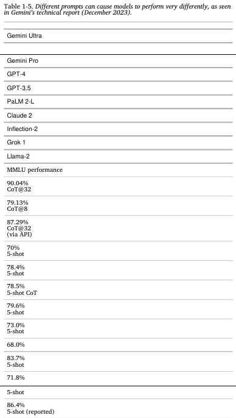

##### Kỹ thuật câu lệnh và Xây dựng Ngữ cảnh

Kỹ thuật câu lệnh (Prompt engineering) là làm cách nào để khiến các mô hình AI thực hiện đúng hành vi mà chúng ta mong muốn chỉ bằng cách cung cấp đầu vào, mà không cần thay đổi đến trọng số của mô hình. Câu chuyện về việc đánh giá Gemini ở trên đã nêu bật tác động của kỹ thuật câu lệnh đối với hiệu suất của mô hình. Bằng cách sử dụng một kỹ thuật câu lệnh khác, hiệu suất của Gemini Ultra trên bộ kiểm chuẩn MMLU đã tăng từ 83.7% lên 90.04%.

Hoàn toàn có thể khiến một mô hình làm được những điều đáng kinh ngạc chỉ bằng các câu lệnh. Những chỉ dẫn đúng đắn có thể khiến một mô hình thực hiện tác vụ bạn muốn, theo đúng định dạng bạn chọn. Kỹ thuật câu lệnh không chỉ là việc ra lệnh cho mô hình phải làm gì. Nó còn là việc cung cấp cho mô hình ngữ cảnh và các công cụ cần thiết để thực hiện một tác vụ nhất định. Đối với các tác vụ phức tạp với ngữ cảnh dài, bạn cũng có thể cần cung cấp cho mô hình một hệ thống quản lý bộ nhớ để mô hình có thể theo dõi lịch sử của nó. Chương 5 sẽ thảo luận về kỹ thuật câu lệnh, và Chương 6 sẽ thảo luận về việc xây dựng ngữ cảnh.

##### Giao diện AI

Giao diện AI có nghĩa là tạo ra một giao diện để người dùng cuối tương tác với các ứng dụng AI của bạn. Trước khi có các mô hình nền tảng, chỉ những tổ chức có đủ nguồn lực để tự phát triển mô hình AI mới có thể phát triển các ứng dụng AI. Các ứng dụng này thường được nhúng vào các sản phẩm hiện có của các tổ chức đó. Ví dụ, tính năng phát hiện gian lận được nhúng vào Stripe, Venmo, và PayPal. Các hệ thống gợi ý là một phần của các mạng xã hội và các ứng dụng truyền thông như Netflix, TikTok, và Spotify.

Với các mô hình nền tảng, bất kỳ ai cũng có thể xây dựng ứng dụng AI. Bạn có thể cung cấp các ứng dụng AI của mình dưới dạng các sản phẩm độc lập hoặc nhúng chúng vào các sản phẩm khác, bao gồm cả các sản phẩm do người khác phát triển. Ví dụ, ChatGPT và Perplexity là các sản phẩm độc lập, trong khi GitHub Copilot thường được sử dụng như một plug-in trong VSCode, và Grammarly thường được sử dụng như một tiện ích mở rộng trình duyệt cho Google Docs. Midjourney có thể được sử dụng thông qua ứng dụng web độc lập của nó hoặc thông qua việc tích hợp vào Discord.

Do đó, cần phải có các công cụ cung cấp giao diện cho các ứng dụng AI độc lập hoặc giúp cho việc tích hợp AI vào các sản phẩm hiện có trở nên dễ dàng. Dưới đây là một số giao diện đang ngày càng phổ biến cho các ứng dụng AI:

*   Các ứng dụng web, máy tính, và di động độc lập.²⁶
*   Các tiện ích mở rộng trình duyệt cho phép người dùng nhanh chóng truy vấn các mô hình AI trong khi duyệt web.
*   Các chatbot được tích hợp vào các ứng dụng trò chuyện như Slack, Discord, WeChat, và WhatsApp.
*   Nhiều sản phẩm, bao gồm VSCode, Shopify, và Microsoft 365, cung cấp các API cho phép các nhà phát triển tích hợp AI vào sản phẩm của họ dưới dạng các plug-in và add-on. Các API này cũng có thể được các agent AI sử dụng để tương tác với thế giới, như sẽ được thảo luận trong Chương 6.

Mặc dù giao diện trò chuyện (chat) là loại được sử dụng phổ biến nhất, giao diện AI cũng có thể dựa trên giọng nói (như với các trợ lý giọng nói) hoặc được hiện thân hóa (như trong thực tế tăng cường và thực tế ảo).

Những giao diện AI mới này cũng mang đến những cách mới để thu thập và trích xuất phản hồi của người dùng. Giao diện trò chuyện giúp người dùng đưa ra phản hồi bằng ngôn ngữ tự nhiên dễ dàng hơn rất nhiều, nhưng loại phản hồi này lại khó trích xuất hơn. Việc thiết kế hệ thống phản hồi của người dùng sẽ được thảo luận trong Chương 10.

Bảng 1-6 dưới đây sẽ tóm tắt sự thay đổi về tầm quan trọng của các hạng mục khác nhau trong việc phát triển ứng dụng khi chuyển sang Kỹ thuật AI.

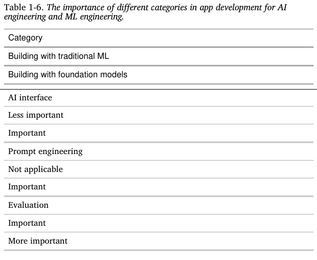

### 4.3. So sánh Kỹ thuật AI và Kỹ thuật Full-Stack

Việc ngày càng chú trọng vào phát triển ứng dụng, đặc biệt là về giao diện, đã đưa Kỹ thuật AI đến gần hơn với lĩnh vực phát triển full-stack.²⁷ Tầm quan trọng ngày càng tăng của giao diện đã dẫn đến một sự thay đổi trong thiết kế của các công cụ AI, nhằm mục đích thu hút thêm các kỹ sư frontend.

Trước đây, Kỹ thuật Học máy thường tập trung vào Python. Trước khi có các mô hình nền tảng, các framework Học máy phổ biến nhất chủ yếu hỗ trợ API Python. Ngày nay, Python vẫn còn phổ biến, nhưng cũng có sự hỗ trợ ngày càng tăng cho các API JavaScript, có thể kể đến như LangChain.js, Transformers.js, thư viện Node của OpenAI, và AI SDK của Vercel.

Mặc dù nhiều Kỹ sư AI xuất thân từ nền tảng Học máy truyền thống, ngày càng có nhiều người đến từ nền tảng phát triển web hoặc full-stack. Một lợi thế mà các kỹ sư full-stack có được so với các kỹ sư học máy truyền thống là khả năng nhanh chóng biến ý tưởng thành các bản demo, nhận phản hồi, và lặp lại để cải tiến.

Với Kỹ thuật Học máy truyền thống, bạn thường bắt đầu bằng việc thu thập dữ liệu và huấn luyện một mô hình. Việc xây dựng sản phẩm được thực hiện sau cùng. Tuy nhiên, với việc các mô hình AI đã có sẵn ngày nay, chúng ta hoàn toàn có thể **bắt đầu bằng việc xây dựng sản phẩm trước**, và chỉ đầu tư vào dữ liệu và mô hình sau khi sản phẩm cho thấy sự hứa hẹn, như được minh họa trong Hình 1-16.

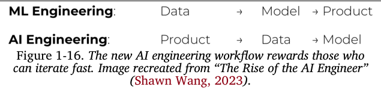

Trong Kỹ thuật Học máy truyền thống, việc phát triển mô hình và phát triển sản phẩm thường là hai quy trình tách biệt. Tại nhiều tổ chức, các kỹ sư học máy hiếm khi được tham gia vào các quyết định liên quan đến sản phẩm.

Tuy nhiên, với các mô hình nền tảng ngày nay, các kỹ sư AI lại có xu hướng tham gia sâu hơn rất nhiều vào quá trình xây dựng sản phẩm.

## 5. Tóm tắt

Tôi viết chương này với hai mục đích. Một là để giải thích sự trỗi dậy của Kỹ thuật AI như một lĩnh vực riêng, nhờ vào sự sẵn có của các mô hình nền tảng. Hai là để cung cấp một cái nhìn tổng quan về quy trình cần thiết để xây dựng các ứng dụng dựa trên các mô hình này. Tôi hy vọng rằng chương này đã đạt được mục tiêu đó. Là một chương tổng quan, nó chỉ đề cập lướt qua nhiều khái niệm. Những khái niệm này sẽ được khám phá sâu hơn trong phần còn lại của cuốn sách.

Chương này đã thảo luận về sự phát triển nhanh chóng của AI trong những năm gần đây. Nó đã điểm qua một số chuyển đổi đáng chú ý nhất, bắt đầu từ sự chuyển dịch từ các mô hình ngôn ngữ sang các mô hình ngôn ngữ lớn, nhờ vào một phương pháp huấn luyện gọi là tự giám sát. Sau đó, nó đã theo dõi cách các mô hình ngôn ngữ kết hợp các dạng dữ liệu khác để trở thành các mô hình nền tảng, và cách các mô hình nền tảng đã tạo nên sự trỗi dậy của Kỹ thuật AI.

Sự phát triển nhanh chóng của Kỹ thuật AI được thúc đẩy bởi vô số các ứng dụng được tạo ra nhờ vào các khả năng mới nổi của các mô hình nền tảng. Chương này đã thảo luận về một số mô hình ứng dụng thành công nhất, dành cho cả người tiêu dùng và doanh nghiệp. Mặc dù đã có một số lượng đáng kinh ngạc các ứng dụng AI đang được vận hành, chúng ta vẫn đang ở trong giai đoạn đầu của Kỹ thuật AI, với vô số các đổi mới khác vẫn chưa được xây dựng.

Trước khi xây dựng một ứng dụng, một câu hỏi quan trọng nhưng thường bị bỏ qua là liệu bạn có nên xây dựng nó hay không. Chương này đã thảo luận về câu hỏi này cùng với các cân nhắc chính khi xây dựng các ứng dụng AI.

Mặc dù Kỹ thuật AI là một thuật ngữ mới, nó đã phát triển từ Kỹ thuật Học máy, vốn là lĩnh vực bao quát hơn liên quan đến việc xây dựng các ứng dụng với tất cả các mô hình học máy. Nhiều nguyên tắc từ Kỹ thuật Học máy vẫn có thể áp dụng cho Kỹ thuật AI. Tuy nhiên, Kỹ thuật AI cũng mang đến những thách thức và giải pháp mới. Phần cuối của chương đã thảo luận về hệ thống công nghệ Kỹ thuật AI, bao gồm cả sự thay đổi của nó so với Kỹ thuật Học máy.

Một khía cạnh của Kỹ thuật AI đặc biệt khó để diễn tả bằng lời là năng lượng tập thể, sự sáng tạo, và tài năng kỹ thuật đáng kinh ngạc mà cộng đồng đang mang lại. Sự nhiệt huyết tập thể này đôi khi có thể gây choáng ngợp, vì không thể nào cập nhật kịp với các kỹ thuật, khám phá, và các thành tựu kỹ thuật mới dường như xảy ra liên tục.

Một niềm an ủi là vì AI rất giỏi trong việc tổng hợp thông tin, nó có thể giúp chúng ta tổng hợp và tóm tắt tất cả những cập nhật mới này. Nhưng công cụ chỉ có thể giúp ích đến một mức độ nhất định. Một lĩnh vực càng choáng ngợp, việc có một khuôn khổ để giúp chúng ta định hướng lại càng quan trọng. Cuốn sách này nhằm mục đích cung cấp một khuôn khổ như vậy.

Phần còn lại của cuốn sách sẽ khám phá khuôn khổ này từng bước một, bắt đầu với khối xây dựng cơ bản của Kỹ thuật AI: các mô hình nền tảng, thứ đã làm cho rất nhiều ứng dụng tuyệt vời trở nên khả thi.

---
### Chú giải

¹ Trong cuốn sách này, tôi sử dụng thuật ngữ "Học máy truyền thống" để chỉ tất cả các phương pháp Học máy trước khi có các mô hình nền tảng.

² Đối với các ngôn ngữ không phải tiếng Anh, một ký tự Unicode đôi khi có thể được biểu diễn thành nhiều token.

³ Các mô hình ngôn ngữ tự hồi quy đôi khi được gọi là các mô hình ngôn ngữ nhân quả (causal language models).

⁴ Về mặt kỹ thuật, một mô hình ngôn ngữ che khuất như BERT cũng có thể được sử dụng để sinh văn bản nếu bạn thực sự cố gắng.

⁵ Chi phí gán nhãn dữ liệu thực tế thay đổi tùy thuộc vào nhiều yếu tố, bao gồm độ phức tạp của tác vụ, quy mô (các bộ dữ liệu lớn hơn thường có chi phí trên mỗi mẫu thấp hơn), và nhà cung cấp dịch vụ gán nhãn. Ví dụ, tính đến tháng 9 năm 2024, Amazon SageMaker Ground Truth tính phí 8 cent cho mỗi hình ảnh để gán nhãn dưới 50.000 hình ảnh, nhưng chỉ 2 cent cho mỗi hình ảnh để gán nhãn hơn 1 triệu hình ảnh.

⁶ Điều này cũng tương tự như việc con người cần phải biết khi nào nên ngừng nói.

⁷ Ở trường, tôi được dạy rằng các tham số mô hình bao gồm cả trọng số mô hình và độ lệch mô hình (biases). Tuy nhiên, ngày nay, chúng ta thường dùng thuật ngữ "trọng số mô hình" để chỉ tất cả các tham số.

⁸ Có vẻ phi logic khi các mô hình lớn hơn lại đòi hỏi nhiều dữ liệu huấn luyện hơn. Nếu một mô hình mạnh mẽ hơn, lẽ ra nó phải cần ít ví dụ hơn để học chứ? Tuy nhiên, chúng ta không cố gắng làm cho một mô hình lớn đạt được hiệu suất của một mô hình nhỏ trên cùng một dữ liệu. Chúng ta đang cố gắng tối đa hóa hiệu suất của mô hình.

⁹ Để so sánh, toàn bộ chi tiêu của Hoa Kỳ cho các trường tiểu học và trung học công lập là khoảng 900 tỷ đô la, chỉ gấp chín lần các khoản đầu tư vào AI ở Hoa Kỳ.

¹⁰ Một sự thật thú vị: tính đến ngày 16 tháng 9 năm 2024, trang web theresanaiforthat.com đã liệt kê 16.814 AI cho 14.688 tác vụ và 4.803 công việc.

¹¹ Khám phá các ứng dụng AI khác nhau có lẽ là một trong những điều tôi thích nhất khi viết cuốn sách này. Thật thú vị khi xem mọi người đang xây dựng những gì. Bạn có thể tìm thấy danh sách các ứng dụng AI mã nguồn mở mà tôi theo dõi. Danh sách được cập nhật 12 giờ một lần.

¹² Bởi vì các doanh nghiệp thường chi rất nhiều tiền cho quảng cáo và tiếp thị, việc tự động hóa trong lĩnh vực này có thể dẫn đến những khoản tiết kiệm khổng lồ. Trung bình, 11% ngân sách của một công ty được chi cho tiếp thị. Xem “Marketing Budgets Vary by Industry” (Christine Moorman, WSJ, 2017).

¹³ Tôi đã nhận thấy AI rất hữu ích trong quá trình viết cuốn sách này, và tôi có thể thấy rằng AI sẽ có thể tự động hóa nhiều phần của quá trình viết. Khi viết truyện viễn tưởng, tôi thường yêu cầu AI khởi tạo ý tưởng về những gì nó nghĩ sẽ xảy ra tiếp theo hoặc cách một nhân vật có thể phản ứng với một tình huống. Tôi vẫn đang đánh giá xem loại văn bản nào có thể được tự động hóa và loại nào không thể.

¹⁴ Giả thuyết của tôi là chúng ta sẽ trở nên mất lòng tin vào nội dung trên internet đến mức chúng ta sẽ chỉ đọc nội dung được tạo ra bởi những người hoặc thương hiệu mà chúng ta tin tưởng.

¹⁵ Tôi rất ngạc nhiên về việc Apple và Amazon đã mất bao lâu để tích hợp những tiến bộ của AI tạo sinh vào Siri và Alexa. Một người bạn của tôi nghĩ rằng đó là vì các công ty này có thể có những tiêu chuẩn cao hơn về chất lượng và tuân thủ, và việc phát triển giao diện giọng nói mất nhiều thời gian hơn so với giao diện trò chuyện.

¹⁶ Tuyên bố miễn trừ trách nhiệm: Tôi là một cố vấn của Convai.

¹⁷ Tôi hiện có hơn 40.000 ảnh và video trong Google Photos của mình. Nếu không có AI, gần như không thể để tôi tìm kiếm những bức ảnh tôi muốn, vào lúc tôi muốn chúng.

¹⁸ Cá nhân tôi cũng thấy AI rất giỏi trong việc giải thích dữ liệu và biểu đồ. Khi gặp một biểu đồ khó hiểu với quá nhiều thông tin, tôi yêu cầu ChatGPT phân tích nó cho tôi.

¹⁹ Tuy nhiên, các công ty khởi nghiệp nhỏ hơn có thể phải ưu tiên tập trung vào sản phẩm và không đủ khả năng để có dù chỉ một người "quan sát xung quanh".

²⁰ Một câu chuyện đùa trong những ngày đầu của AI tạo sinh là các công ty khởi nghiệp về AI chỉ là những "lớp vỏ" (wrappers) của OpenAI hoặc Claude.

²¹ Trong quá trình viết cuốn sách này, tôi khó có thể nói chuyện với bất kỳ công ty khởi nghiệp AI nào mà không nghe thấy cụm từ "bánh đà dữ liệu" (data flywheel).

²² Tuyên bố miễn trừ trách nhiệm: Tôi là một nhà đầu tư vào Photoroom.

²³ Như người đứng đầu bộ phận AI tại một công ty trong danh sách Fortune 500 đã nói với tôi: đội của ông ấy biết cách làm việc với 10 GPU, nhưng họ không biết cách làm việc với 1.000 GPU.

²⁴ Và họ được đề nghị những gói đãi ngộ đáng kinh ngạc.

²⁵ Nếu bạn thấy các thuật ngữ "tiền huấn luyện" và "hậu huấn luyện" thiếu trí tưởng tượng, bạn không đơn độc đâu. Cộng đồng nghiên cứu AI rất giỏi ở nhiều thứ, nhưng đặt tên không phải là một trong số đó. Chúng ta đã nói về việc "mô hình ngôn ngữ lớn" khó có thể là một thuật ngữ khoa học vì sự mơ hồ của từ "lớn". Và tôi thực sự ước gì mọi người sẽ ngừng xuất bản các bài báo có tiêu đề "X là tất cả những gì bạn cần".

²⁶ Streamlit, Gradio, và Plotly Dash là các công cụ phổ biến để xây dựng các ứng dụng web AI.

²⁷ Anton Bacaj đã nói với tôi rằng "Kỹ thuật AI chỉ là kỹ thuật phần mềm với các mô hình AI được thêm vào hệ thống".

